# Dockerized E-Learning Platform | Django, REST & Real-Time Features

This project is a Dockerized version of the final project initiated by me from *Django 5 By Example* by Antonio Melé.
It includes REST APIs, real-time features with WebSockets, and a fully containerized setup for development and production.

> **Note:** Make sure to run Docker commands from the same path as your editor to avoid path issues.

---

# Chapter 12. Building an E-Learning Platform

## In this chapter, you will learn how to:
- Course and enrollment system implementation
- Introduction to Docker, including Dockerfile, docker-compose configuration (YAML), and `wait- for-it.sh` script integration
- Create models for the CMS
- Create fixtures for your models and apply them
- Use model inheritance to create data models for polymorphic content
- Create custom model fields
- Order course contents and modules
- Build authentication views for the CMS

## Copy/past the file 'wait-for-it.sh' from the Antonio Melé GitHub.

#  Setting up the e-learning project with Docker:

## Dockerfile:

```dockerfile
FROM python:3.12.6

ENV PYTHONDONTWRITEBYTECODE=1
ENV PYTHONUNBUFFERED=1

WORKDIR /code

RUN pip install --upgrade pip

COPY requirements.txt .
RUN pip install -r requirements.txt

COPY . .

COPY wait-for-it.sh /code/wait-for-it.sh
RUN chmod +x /code/wait-for-it.sh
```

## This code performs the following tasks:

1. The Python 3.12.6 parent Docker image is used. You can find the official Python Docker image at https://hub.docker.com/_/python.

2. The following environment variables are set:

	a. PYTHONDONTWRITEBYTECODE : This prevents Python from writing out pyc files.

	b. PYTHONUNBUFFERED : This ensures that the Python stdout and stderr streams are sent 	straight to the terminal without first being buffered.

3. The WORKDIR command is used to define the working directory of the image.

4. The pip package of the image is upgraded.

5. The requirements.txt file is copied to the working directory (. ) of the parent Python image.

6. The Python packages in requirements.txt are installed in the image using pip .

7. The Django project source code is copied from the local directory to the working directory (. ) directory of the image.

## Create a docker-compose.yml:

```yml
services:
  db:
    image: postgres:16.2
    restart: always
    volumes:
      - ./data/db:/var/lib/postgresql/data
    environment:
      POSTGRES_DB: postgres
      POSTGRES_USER: postgres
      POSTGRES_PASSWORD: postgres

  cache:
    image: redis:7.2.4
    restart: always
    volumes:
      - ./data/cache:/data

  web:
    build: .
    command: ["./wait-for-it.sh", "db:5432", "--", "python", "manage.py", "runserver",   "0.0.0.0:8000"]
    volumes:
      - .:/code
    ports:
      - "8000:8000"
    environment:
      DJANGO_SETTINGS_MODULE: educa.settings
      POSTGRES_DB: postgres
      POSTGRES_USER: postgres
      POSTGRES_PASSWORD: postgres
    depends_on:
      - db
      - cache
```

## In this file, you define a web service. The sections to define this service are as follows:

- build 
- command 
- restart 
- volumes 
- ports 
- environment

## Create a requirements.txt:

```text
asgiref==3.8.1
Django==5.0.4
Pillow==10.3.0
sqlparse==0.5.0
django-braces==1.15.0
django-embed-video==1.4.9
pymemcache==4.0.0
django-debug-toolbar==4.3.0
redis==5.0.4
django-redisboard==8.4.0
djangorestframework==3.15.1
requests==2.31.0
channels[daphne]==4.1.0
channels-redis==4.2.0
psycopg==3.1.18
uwsgi==2.0.25.1
python-decouple==3.8
setuptools<81
```

## Note:

> **Note:** If some packages in `requirements.txt` appear with missing versions (e.g. `...`), example:
Pillow==10.3.0
...    < 3 dots
 install them manually using:
>
> ```bash
> python -m pip install \*<package-name>\*
> ```

## Build images

```bash
Docker compose build
```

## Create a Django project using the following command:

```bash
docker compose run --rm web django-admin startproject educa . 
```

# Setting up your setting.py

## setting.py

### Replace this one:

```python
DATABASES = {

   'default': {

       'ENGINE': 'django.db.backends.sqlite3'
```

### By this one:

```python
DATABASES = {

   'default': {

       'ENGINE': 'django.db.backends.postgresql',

       'NAME': 'postgres',

       'USER': 'postgres',

       'PASSWORD': 'postgres',

       'HOST': 'db',

       'PORT': 5432,

   }

}
```

## Run containers

```bash
docker compose up
```

## Migrate on Docker now run:

```bash
docker compose run --rm web python manage.py migrate
```

## Create a new application using the following commands:

```bash
docker compose run --rm web python manage.py startapp courses
```

## Edit the settings.py file of the educa project:

```python
INSTALLED_APPS = [
    # Local Apps:
    'courses.apps.CoursesConfig',
    
    # Default Django Apps:
    'django.contrib.admin',
    'django.contrib.auth',
    'django.contrib.contenttypes',
    'django.contrib.sessions',
    'django.contrib.messages',
    'django.contrib.staticfiles',
]
```

# Serving media files

## Edit the settings.py file of the project:

```python
MEDIA\_URL = 'media/'
MEDIA\_ROOT = BASE\_DIR / 'media'
```

# Building the course models

## The Course model fields are as follows:
- owner
- subject
- Subject model
- title
- slug
- overview
- created

## Migration:

```bash
docker compose exec web python manage.py makemigrations
docker compose exec web python manage.py migrate
```

# Registering the models in the administration site

## Using fixtures to provide initial data for models

## Create a superuser using the following command:

```bash
docker compose exec web python manage.py createsuperuser
```

```text
Username (leave blank to use 'admin'): admin
Email address: admin@admin.com
Password: ********
Password (again): ********
```

## Open http://127.0.0.1:8000/admin/courses/subject/ in your browser.
 
## Figure 12.1 The subject change list view on the administration site

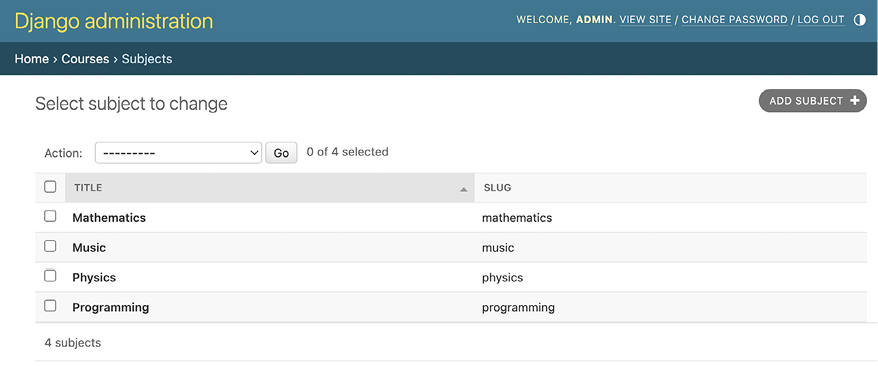
<p>Figure 12.1 The subject change list view on the administration site</p>

## Run the following command from the shell:

```bash
docker compose exec web python manage.py dumpdata courses --indent=2
```

## Save this dump to a fixtures file in a new fixtures/ directory in the courses application using the following commands:

```bash
docker compose exec web mkdir courses/fixtures
docker compose exec web python manage.py dumpdata courses --indent=2 --output=courses/fix
```

> **Note:** The CSS styles used in this template are located in the `static/` directory of the courses application in the code that comes with this chapter. Copy the `static/` directory into the same directory of your project to use them.
 
## Figure 12.2 Deleting all existing subjects

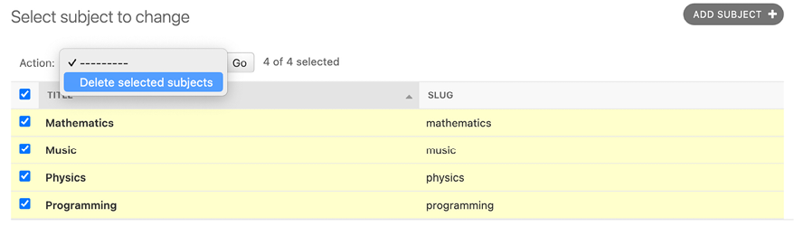
<p>Figure 12.2 Deleting all existing subjects</p>

## After deleting all subjects, load the fixture into the database:

```bash
docker compose exec web python manage.py loaddata subjects.json
```

# All Subject objects included in the fixture are loaded into the database again:
 
## Figure 12.3 Subjects from the fixture are now loaded into the database

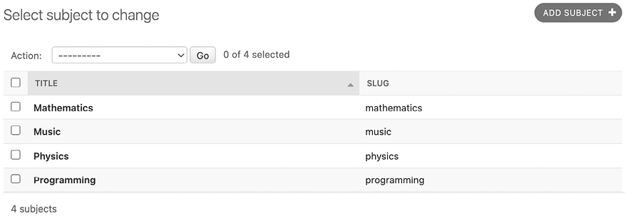
<p>Figure 12.3 Subjects from the fixture are now loaded into the database</p>

# Creating models for polymorphic content

## In your Content model, these are:
- content_type : A ForeignKey field to the ContentType model
- object_id : A PositiveIntegerField to store the primary key of the related object
- item : A GenericForeignKey field to the related object combining the two previous fields

# Using model inheritance

## Django offers the following three options to use model inheritance:
- Abstract models
- Multi-table model inheritance
- Proxy models

# Abstract models

## Figure 12.4 Sample models and database tables for inheritance using abstract models

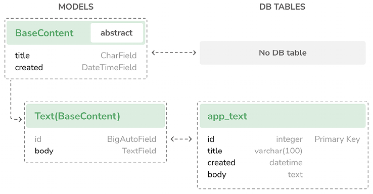
<p>Figure 12.4 Sample models and database tables for inheritance using abstract models</p>

# Multi-table model inheritance
 
## Figure 12.5 Sample models and database tables for multi-table model inheritance

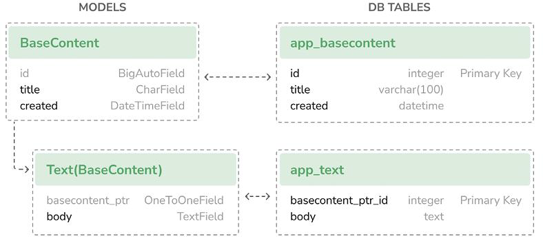
<p>Figure 12.5 Sample models and database tables for multi-table model inheritance</p>

# Proxy models
 
## Figure 12.6 Sample models and database tables for inheritance using proxy models

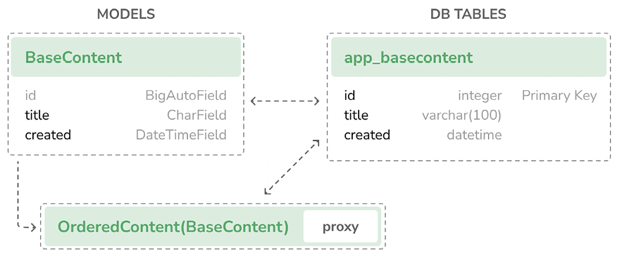
<p>Figure 12.6 Sample models and database tables for inheritance using proxy models</p>

# Creating the Content models
 
## Since you are using '%(class)s_related' as the related_name , the reverse relationship for child models will be text_related , file_related , image_related , and video_related , respectively.

## You have defined four different Content models that inherit from the ItemBase abstract model. They are as follows:
- ItemBase
- Text
- File
- Image
- Video

## Figure 12.7 Content models and associated database tables

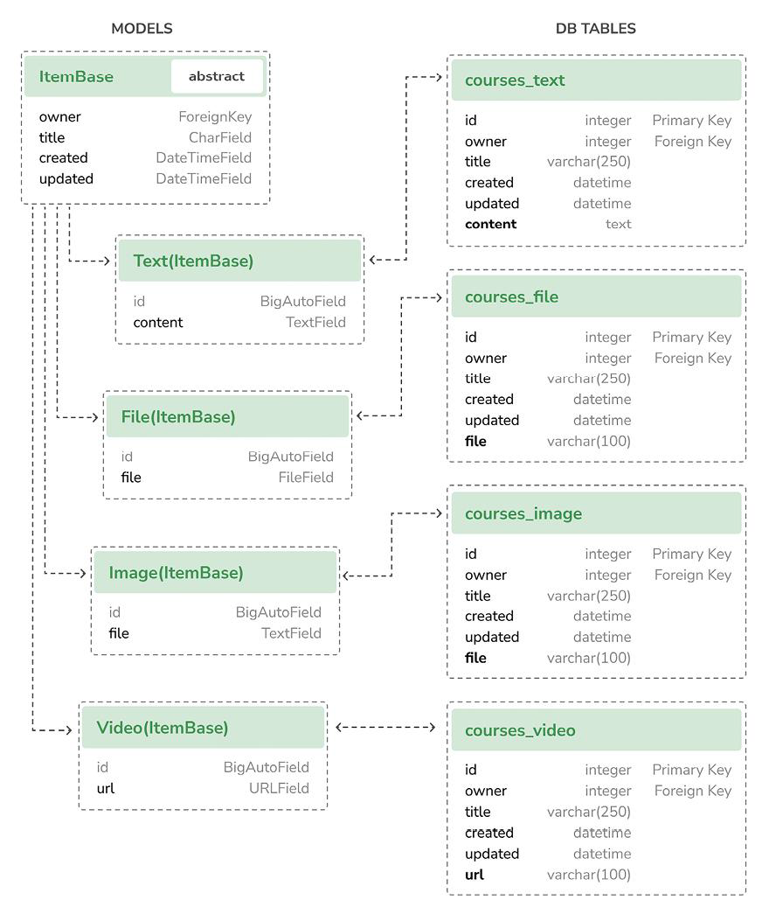
<p>Figure 12.7 Content models and associated database tables</p>

## Migration
 
```bash
docker compose exec web python manage.py makemigration
docker compose exec web python manage.py migrate
```

# Creating custom model fields

## There are two relevant functionalities that you will build into your order field:
- Automatically assign an order value when no specific order is provided
- Order objects with respect to other fields

## Create a new fields.py file inside the courses application directory.

## In this method, you perform the following actions:

1. You check whether a value already exists for this field in the model instance. You use self.attname , which is the attribute name given to the field in the model. If      the attribute’s value is different from None , you calculate the order you should give it as follows:

	a. You build a QuerySet to retrieve all objects for the field’s model. You retrieve the model class the field belongs to by accessing self.model .

	b. If there are any field names in the for_fields attribute of the field, you filter the QuerySet by the current value of the model fields in for_fields . By doing           so, you calculate the order with respect to the given fields.

	c. You retrieve the object with the highest order with last_item =qs.latest(self.attname) from the database. If no object is found,you assume this object is the first        one and assign order 0 to it.

	d. If an object is found, you add 1 to the highest order found.

	e. You assign the calculated order to the field’s value in the model instance using 	setattr() and return it.

2. If the model instance has a value for the current field, you use it instead of calculating it.

# Adding ordering to Module and Content objects

## Migration

```bash
docker compose exec web python manage.py makemigrations courses
```

## You will see the following output:

It is impossible to add a non-nullable field 'order' to content without specifying a default. This is because the database needs something to populate existing rows.
Please select a fix:
 1) Provide a one-off default now (will be set on all existing rows with a null value for this column)
 2) Quit and manually define a default value in models.py.
Select an option:

```text
Django is telling you that you have to provide a default value for the new order field for existing rows in the database. If the field includes null=True , it accepts null values and Django creates the migration automatically instead of asking for a default value. You can specify a default value or cancel the migration and add a default attribute to the order field in the models.py file before creating the migration.

Enter 1 and press Enter to provide a default value for existing records. 
Enter 0 so that this is the default value for existing records and press Enter. 
```

## Migrations with the following command:

```bash
docker compose exec web python manage.py migrate
```

## Open the Python shell to test:

```bash
docker compose exec web python manage.py shell
```

# Adding authentication views

# Adding an authentication system

# Creating the authentication templates

## Create the following file structure inside the courses application directory:

```text
templates/
    base.html
    registration/
        login.html
        logged_out.html
```

## In this template, you define the following blocks:
- title
- content
- domready
- DOMContentLoaded event


> **Note:** The CSS styles used in this template are located in the static/ directory of the courses application in the code that comes with this chapter. Copy the static/ directory into the same directory of your project to use them. You can find the contents of the directory at
https://github.com/PacktPublishing/Django-5-by Example/tree/main/Chapter12/educa/courses/static.

## Open http://127.0.0.1:8000/accounts/login/ in your browser.
 
## Figure 12.8 The account login page

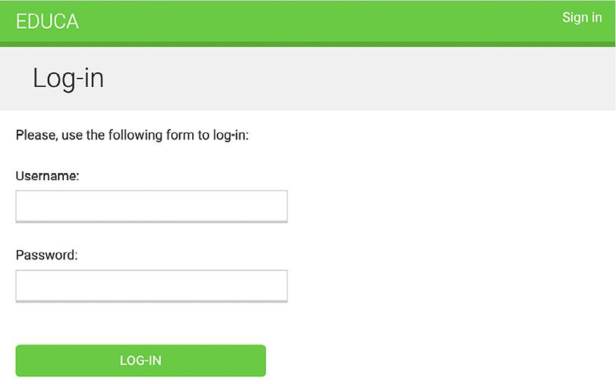
<p>Figure 12.8 The account login page</p>

## Log in with the superuser credentials.

## Open http://127.0.0.1:8000/accounts/login/ again in your browser.
 
## Figure 12.9 The account Logged out page

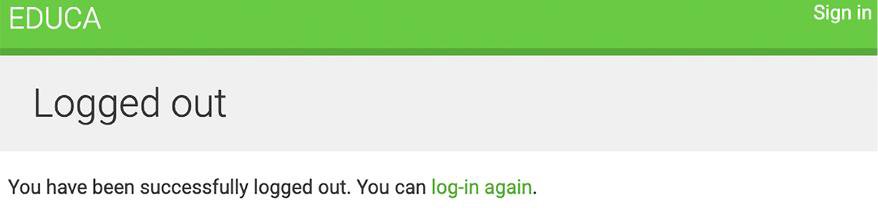
<p>Figure 12.9 The account Logged out page</p>

---

# Chapter 13. Creating a Content Management System

## In this chapter, you will learn how to:
- Create a content management system (CMS) using class-based views and mixins
- Build formsets and model formsets to edit course modules and module contents
- Manage groups and permissions
- Implement a drag-and-drop functionality to reorder modules and content

# Functional overview

## Figure 13.1 Diagram of functionalities built in Chapter 13

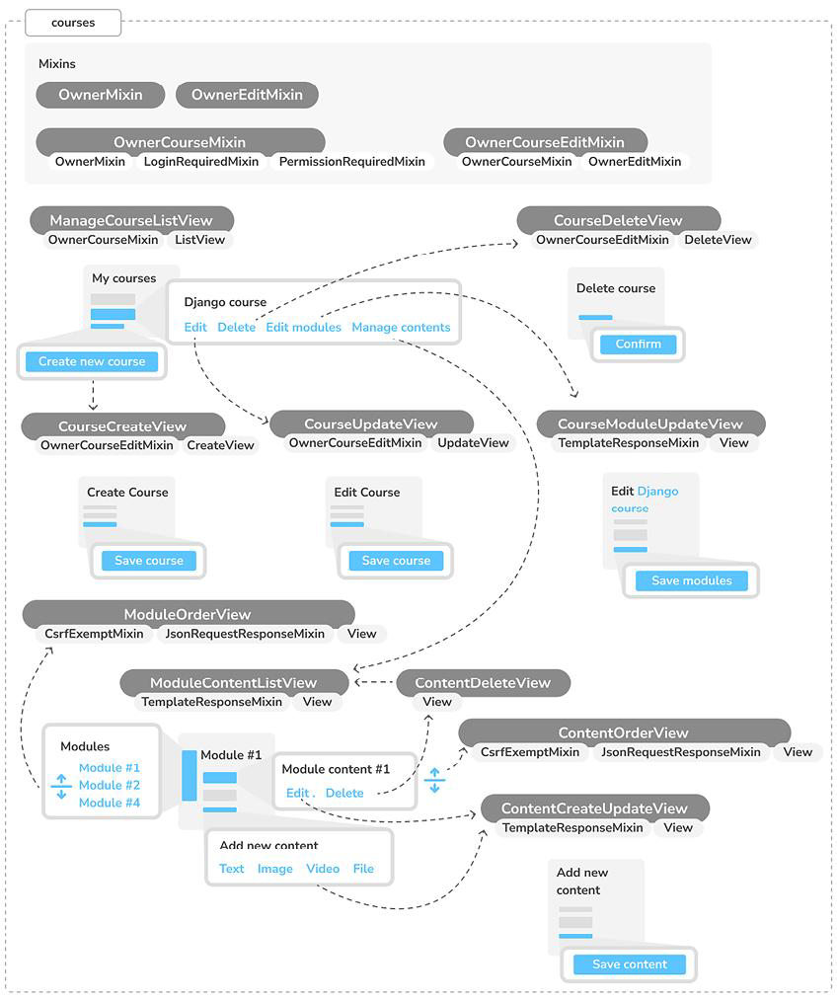
<p>Figure 13.1 Diagram of functionalities built in Chapter 13</p>

# Creating a CMS

## You need to provide the following functionality:
- List the courses created by the instructor
- Create, edit, and delete courses
- Add modules to a course and reorder them
- Add different types of content to each module
- Reorder course modules and content

# Creating class-based views

# Using mixins for class-based views

## There are two main situations for using mixins:
- You want to provide multiple optional features for a class
- You want to use a particular feature in several classes

## OwnerMixin and provides the following attributes for child views:
- model
- fields
- success_url

## You define an OwnerCourseEditMixin mixin with the following attribute:
- template_name

## Finally, you create the following views that subclass OwnerCourseMixin :
- ManageCourseListView
- CourseCreateView
- CourseUpdateView
- CourseDeleteView

# Working with groups and permissions

## Open http://127.0.0.1:8000/admin/auth/group/add/ in your browser

## Figure 13.2 The Instructors group permissions

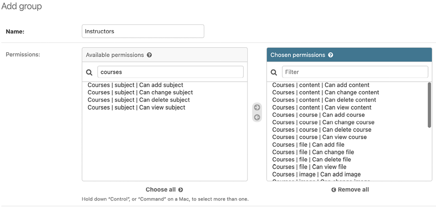
<p>Figure 13.2 The Instructors group permissions</p>

## Figure 13.3 User group selection

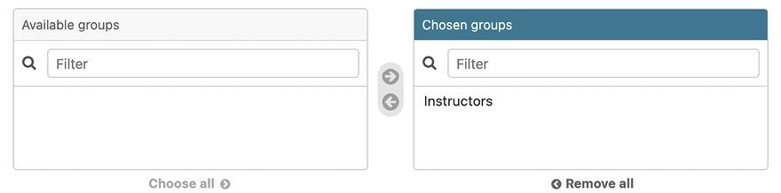
<p>Figure 13.3 User group selection</p>

# Restricting access to class-based views

## django.contrib.auth limit access to two mixins to views:
- LoginRequiredMixin
- PermissionRequiredMixin

## You need to create the templates/ courses application:

```text
courses/
   manage/
    course/
        list.html
        form.html
        delete.html
```

## Open http://127.0.0.1:8000/accounts/login/?next=/course/mine/

## Figure 13.4 The instructor courses page with no courses

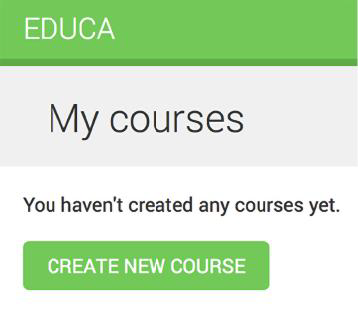
<p>Figure 13.4 The instructor courses page with no courses</p>

## Open http://127.0.0.1:8000/course/mine/

## Figure 13.5 The form to create a new course

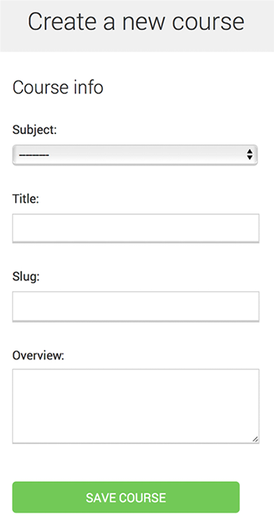
<p>Figure 13.5 The form to create a new course</p>

## Figure 13.6 The instructor courses page with one course

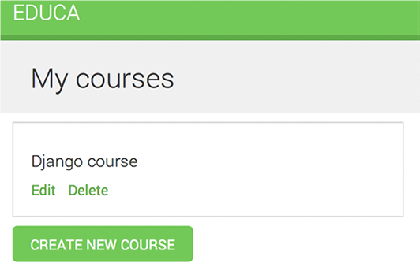
<p>Figure 13.6 The instructor courses page with one course</p>

## Figure 13.7 The Delete course confirmation page

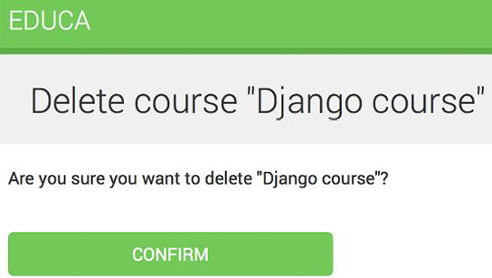
<p>Figure 13.7 The Delete course confirmation page</p>

# Managing course modules and their contents

## Using formsets for course modules

## You use the following parameters to build the formset:
- fields
- extra
- can_delete

## This view inherits from the following mixins and views:
- TemplateResponseMixin
- View : The basic class-based view provided by Django.

## In this view, you implement the following methods:
- get_formset()
- dispatch()
- get()
- post()

## Edit the courses/manage/course/list.html template and add the following link for the course_module_update URL below the course Edit and Delete links:

## Open http://127.0.0.1:8000/course/mine/

## Figure 13.8 The course edit page, including the formset for course modules

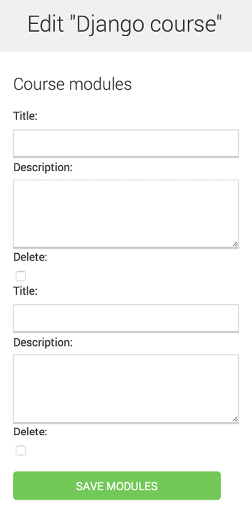
<p>Figure 13.8 The course edit page, including the formset for course modules</p>

# Adding content to course modules
 
## This is the first part of ContentCreateUpdateView:

```text
get_model()
get_form()
dispatch() 
module_id
model_name
id
```

## Add the following get() and post() methods to ContentCreateUpdateView :

## These methods are as follows:
- get()
- post()

## Edit the urls.py file of the courses application

## The new URL patterns are as follows:
- module_content_create
- module_content_update


## Run the development server, open http://127.0.0.1:8000/course/mine/ , click Edit modules for an existing course, and create a module.

## Open the Python shell to test:

```bash
docker compose exec web python manage.py shell
```

```text
Obtain the ID of the most recently created module
>>> from courses.models import Module
>>> Module.objects.latest('id').id
1
```
open http://127.0.0.1:8000/course/module/1/content/image/create/

## Figure 13.9 The course Add new content form

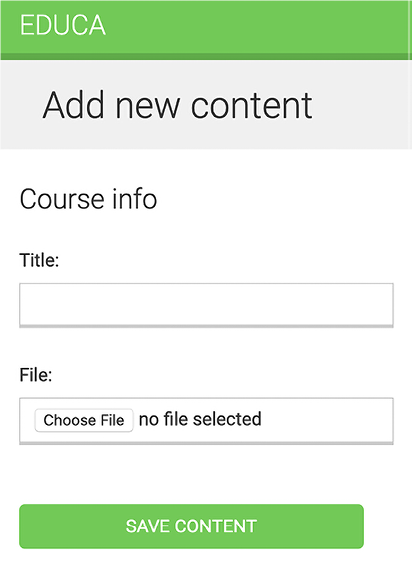
<p>Figure 13.9 The course Add new content form</p>

# Managing modules and their contents

## Create the following file structure inside the courses application directory:

```text
templatetags/
      __init__.py
      course.py
```

## Open http://127.0.0.1:8000/course/mine/

## Figure 13.10 The page to manage course module contents

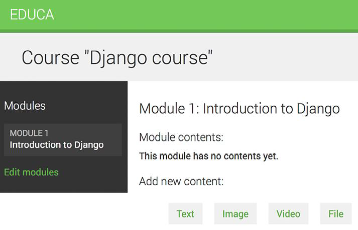
<p>Figure 13.10 The page to manage course module contents</p>

## Figure 13.11 Managing different module contents

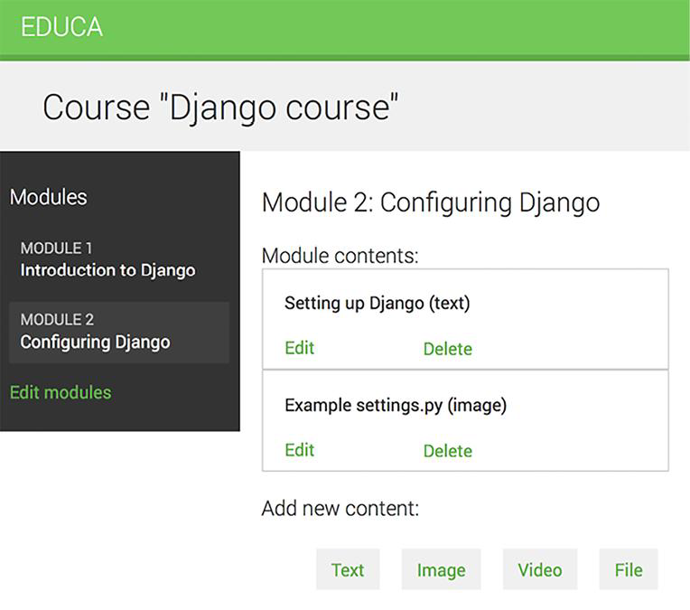
<p>Figure 13.11 Managing different module contents</p>

# Reordering modules and their contents

# Using mixins from djangobraces

## You will use the following mixins of django-braces :
- CsrfExemptMixin
- JsonRequestResponseMixin

## Install django-braces via pip using the following command:

```bash
python -m pip install django-braces==1.15.0
```

## Stop the development server Ctrl + C and run it again:
```bash
docker compose down  
docker compose up --build
```

## Open http://127.0.0.1:8000/course/mine/

## Figure 13.12 Reordering modules with the drag-and-drop functionality

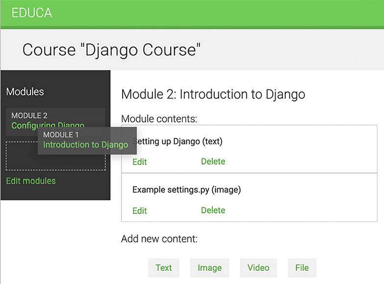
<p>Figure 13.12 Reordering modules with the drag-and-drop functionality</p>

## The following tasks are performed in the event function:

1. An empty modulesOrder dictionary is created.

2. The list elements of the #modules HTML element are selected with document.querySelectorAll().

3. forEach() is used to iterate over each list element.

4. The new index for each module is stored in the modulesOrder dictionary.

5. The order displayed for each module is updated by selecting the element with the order CSS class.
 
6. A key named body is added to the options dictionary with the new order contained in modulesOrder.

7. The Fetch API is used by creating a fetch() HTTP request to update the module order.

## We can now drag and drop modules.

## Figure 13.13 New order for modules after reordering them with drag and drop

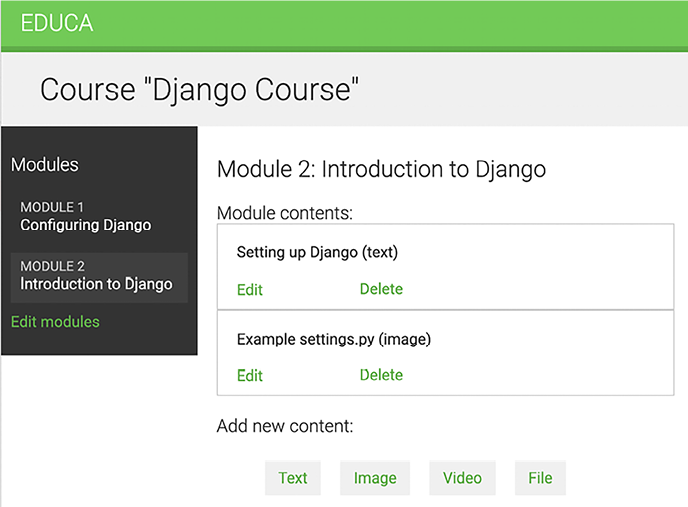
<p>Figure 13.13 New order for modules after reordering them with drag and drop</p>

## Figure 13.14 Reordering module contents with the drag-and-drop functionality

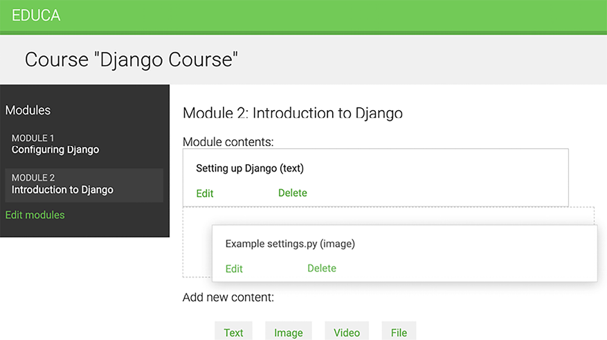
<p>Figure 13.14 Reordering module contents with the drag-and-drop functionality</p>

---

# Chapter 14. Rendering and Caching Content


## In this chapter, you will:

- Create public views for displaying course information
- Build a student registration system
- Manage student enrollment in courses
- Render diverse content for course modules
- Install and configure Memcached
- Cache content using the Django cache framework
- Use the Memcached and Redis cache backends
- Monitor your Redis server in the Django administration site

# Functional overview

## Figure 14.1 Diagram of functionalities built in Chapter 14

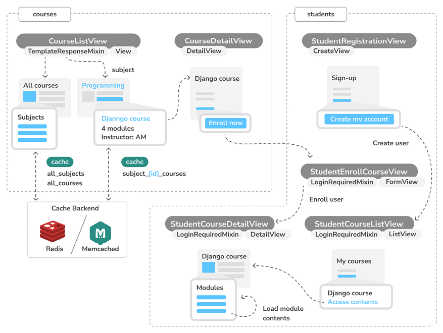
<p>Figure 14.1 Diagram of functionalities built in Chapter 14</p>

## Displaying the catalog of courses
- List all available courses, optionally filtered by subject
- Display a single course overview

## You define the following URL patterns:
- course_list_subject : For displaying all courses for a subject
- course_detail : For displaying a single course overview

## Let’s build templates for the CourseListView and CourseDetailView views:

```text
course/
      list.html
     detail.html
```

## Open http://127.0.0.1:8000/

## Figure 14.2 The course list page

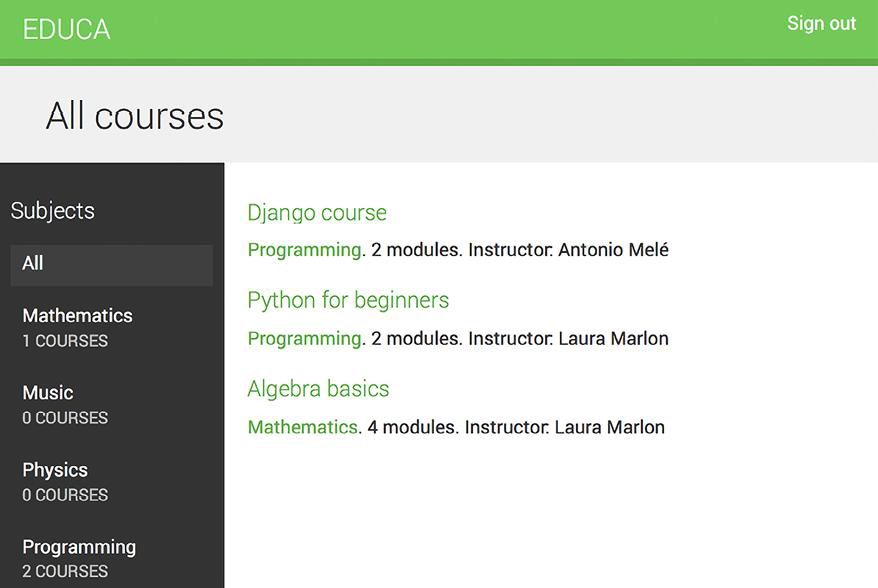
<p>Figure 14.2 The course list page</p>

## Figure 14.3 The course overview page

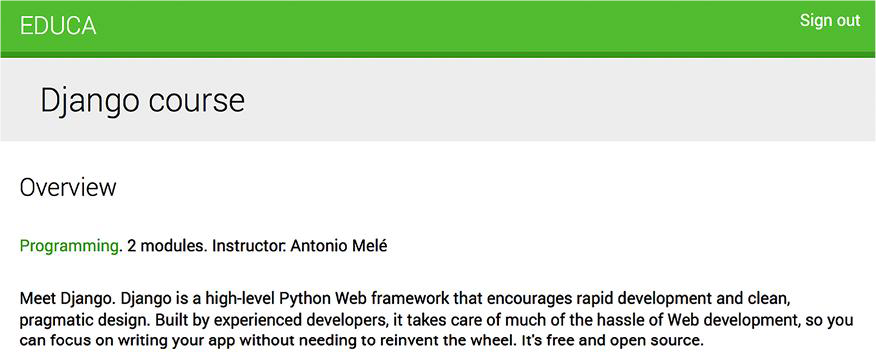
<p>Figure 14.3 The course overview page</p>

## Adding student registration:

```bash
docker compose exec web python manage.py startapp students
```

## settings.py

```python
INSTALLED_APPS = [
    # …
        'students.apps.StudentsConfig',
		# …

]
```

## Creating a student registration view

## This view requires the following attributes:
- template_name
- form_class
- success_url

## Create the following file structure inside the students application directory:

```text
templates/
       students/
              student/
                     registration.html
```

## Open http://127.0.0.1:8000/students/register/

## Figure 14.4 The student registration form

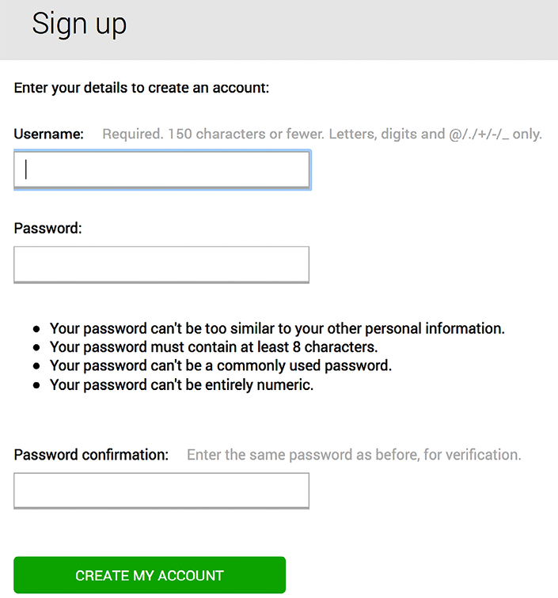
<p>Figure 14.4 The student registration form</p>

# Enrolling in courses

## Migration

```bash
docker compose exec web python manage.py makemigrations
docker compose exec web python manage.py migrate
```

## Figure 14.5 The course overview page, including an ENROLL NOW button

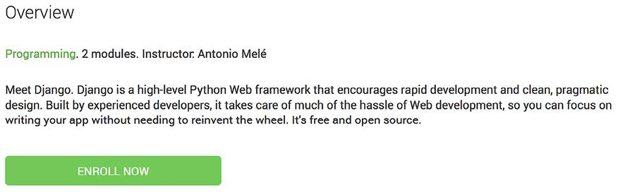
<p>Figure 14.5 The course overview page, including an ENROLL NOW button</p>

# Rendering course contents

# Accessing course contents

# Rendering different types of content

## Create the following file structure inside the templates/courses/ directory of the courses
 application:

```text
content/
         text.html
         file.html
         image.html
         video.html
```

## Install the package with the following command:

```bash
python -m pip install django-embed-video  
```

## Update settings.py

```python
INSTALLED_APPS = [
    # …
        'embed_video',
		# …
]
```

## Open http://127.0.0.1:8000/course/mine/ in your browser.

## Figure 14.6 A course contents page

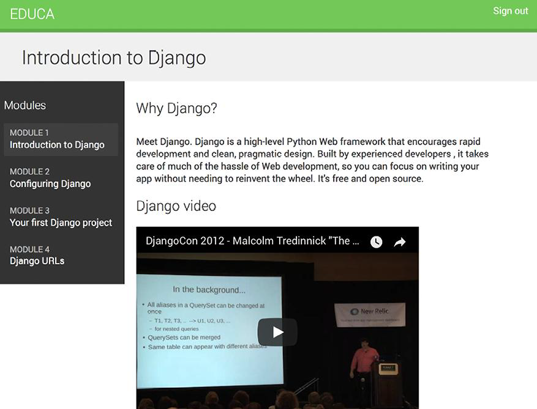
<p>Figure 14.6 A course contents page</p>

# Using the cache framework

## How the cache framework is usually used when your application processes an HTTP request:

1. Try to find the requested data in the cache.

2. If found, return the cached data.

3. If not found, perform the following steps:
	a. Perform the database query or processing required to generate the data.
	b. Save the generated data in the cache.
	c. Return the data.

# Available cache backends

## Django comes with the following cache backends:
- backends.memcached.PyMemcacheCache or backends.memcached.PyLibMCCache
- backends.redis.RedisCache
- backends.db.DatabaseCache
- backends.filebased.FileBasedCache
- backends.locmem.LocMemCache
- backends.dummy.DummyCache

## Installing Memcached:

```bash
docker pull memcached:1.6.26
```

## Run the Memcached Docker container with the following command:
```bash
docker run -it --rm --name memcached -p 11211:11211 memcached:1.6
```

## Installing the Memcached Python binding

```bash
python -m pip install pymemcache==4.0.0
```

# Django cache settings

## Django provides the following cache settings:
- CACHES : A dictionary containing all available caches for the project.
- CACHE_MIDDLEWARE_ALIAS
- CACHE_MIDDLEWARE_KEY_PREFIX
- CACHE_MIDDLEWARE_SECONDS

## This setting allows you to specify the configuration for multiple caches.
- BACKEND
- KEY_FUNCTION
- KEY_PREFIX
- LOCATION
- OPTIONS
- TIMEOUT
- VERSION : The default version number for the cache keys. Useful for cache versioning.

## Adding Memcached to your project

## Update settings.py:

```python
CACHES = {
    'default': {
        'BACKEND': 'django.core.cache.backends.memcached.PyMemcacheCache',
        'LOCATION': '127.0.0.1:11211',
    }
}
```

# Cache levels

## Listed here by ascending order of granularity:
- Low-level cache API
- Template cache
- Per-view cache
- Per-site cache

# Using the low-level cache API

## Open the Python shell to test:

```bash
docker compose exec web python manage.py shell
```

# Checking cache requests with Django Debug Toolbar

## Install Django Debug Toolbar with the following command:

```bash
python -m pip install django-debug-toolbar==4.3.0
```

## Update settings.py:

```python
INSTALLED_APPS = [
    # …
        'debug_toolbar',
		# …

]

MIDDLEWARE = [
    # …
        'debug_toolbar.middleware.DebugToolbarMiddleware',
		# …

]

INTERNAL_IPS = [   
    # …
        '127.0.0.1',
		# …

]
```

## Open http://127.0.0.1:8000/ in your browser.

> **Note:** If you use docker starting on chapter 12 your django-debug-toolbar will not show up. To have django-debug-toolbar on Docker run the following process:

## TOOLBAR FIX:

```text
FIRST Find your Django container name.
RUN: docker ps

Your Django container is:
chapter14renderingandcachingcontent-web-1

Now run this exactly in PowerShell:
docker inspect chapter14renderingandcachingcontent-web-1 | findstr Gateway

OUTPUT:
Gateway 
"Gateway": "", 
"IPv6Gateway": "", 
	"Gateway": "172.19.0.1", 
	"IPv6Gateway": "",
```

## Now add it to INTERNAL_IPS in your settings.py:

```python
INTERNAL_IPS = [
   "127.0.0.1",
   "172.19.0.1",  <-- can be different IP address
]
```

## Then restart the containers:
```bash
docker compose down
docker compose up
```

## Figure 14.7 The Cache panel of Django Debug Toolbar including cache requests for CourseListView on a cache miss

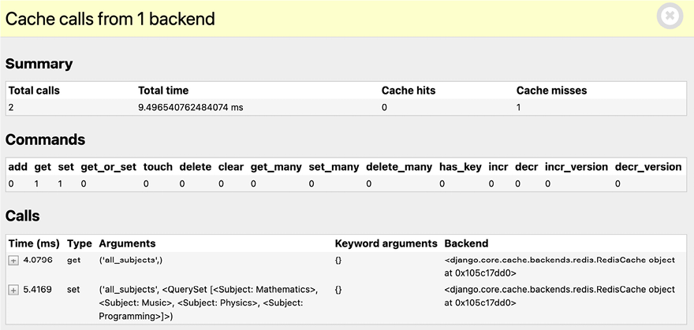
<p>Figure 14.7 The Cache panel of Django Debug Toolbar including cache requests for CourseListView on a cache miss</p>

## Figure 14.8 SQL queries executed for CourseListView on a cache miss

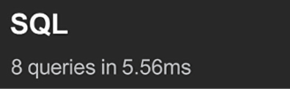
<p>Figure 14.8 SQL queries executed for CourseListView on a cache miss</p>

## Figure 14.9 The Cache panel of Django Debug Toolbar, including cache requests for the CourseListView view on a cache hit

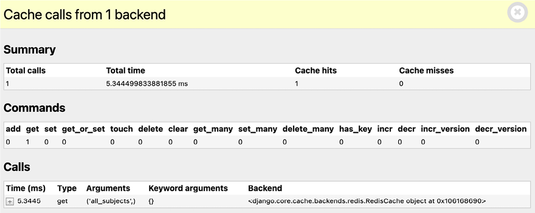
<p>Figure 14.9 The Cache panel of Django Debug Toolbar, including cache requests for the CourseListView view on a cache hit</p>

## Figure 14.10 SQL queries executed for CourseListView on a cache hit

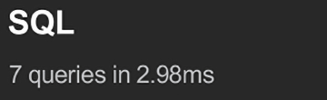
<p>Figure 14.10 SQL queries executed for CourseListView on a cache hit</p>

# Low-level caching based on dynamic data

# Caching template fragments

# Caching views

# Using the per-site cache

## Update settings.py:

```python
MIDDLEWARE = [
    # …
        `django.middleware.cache.UpdateCacheMiddleware`,
        `django.middleware.cache.FetchFromCacheMiddleware'
		# …

]

CACHE_MIDDLEWARE_ALIAS = 'default'
CACHE_MIDDLEWARE_SECONDS = 60 \* 15  # 15 minutes
CACHE_MIDDLEWARE_KEY_PREFIX = 'educa'
```

# Using the Redis cache backend

## Install redis-py in your environment:

```bash
python -m pip install redis==5.0.4
```

## Update settings.py:

```python
CACHES = {
    'default': {
       'BACKEND': 'django.core.cache.backends.redis.RedisCache',
       'LOCATION': 'redis://127.0.0.1:6379',
    }
}
```

## Initialize the Redis Docker container using the following command:

```bash
docker run -it --rm --name redis -p 6379:6379 redis:7.2.4
```

# Monitoring Redis with Django Redisboard

## Install django-redisboard in your environment:

```bash
python -m pip install django-redisboard==8.4.0
```

## Update settings.py:

```bash
- Add `redisboard` to `INSTALLED_APPS`
```

## Migrations:
```bash
python manage.py migrate redisboard
```

## Open http://127.0.0.1:8000/admin/redisboard/redisserver/add/ in your browser

## Figure 14.11 The form to add a Redis server for Django Redisboard in the administration site

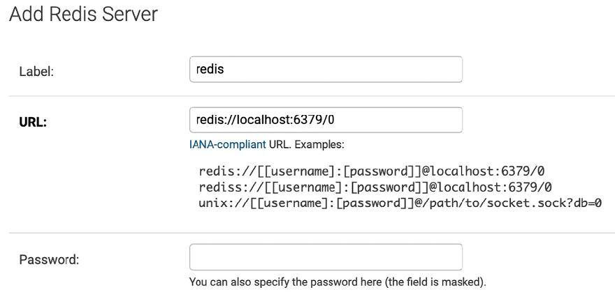
<p>Figure 14.11 The form to add a Redis server for Django Redisboard in the administration site</p>

## Figure 14.12 The Redis monitoring of Django Redisboard on the administration site

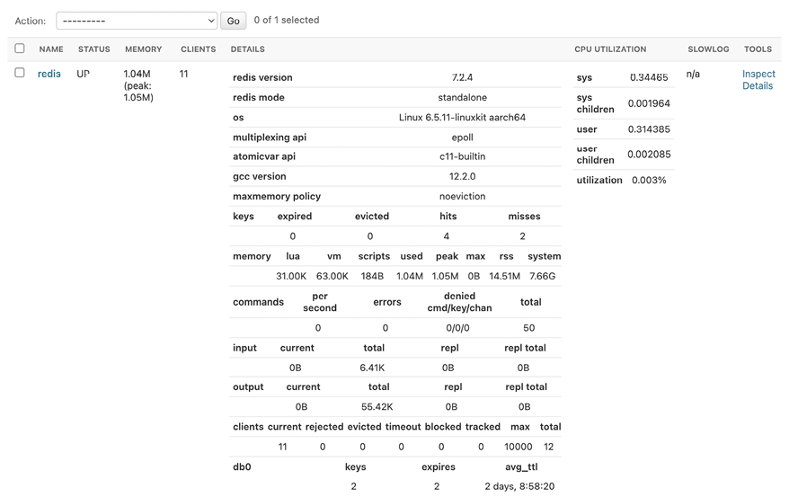
<p>Figure 14.12 The Redis monitoring of Django Redisboard on the administration site</p>

---

# Chapter 15. Building an API.

> **Note:** Since is new chapter you container IP address change, therefore, your debug-toolbar does not work anymore and we really want it to show, go back to chapter 14 'TOOLBAR FIX' follow the instruction and do the same for each chapter.

## In this chapter, you will:
- Install Django REST framework
- Create serializers for your models
- Build a RESTful API
- Implement serializer method fields
- Create nested serializers
- Implement ViewSet views and routers
- Build custom API views
- Handle API authentication
- Add permissions to API views
- Create custom permissions
- Use the Requests library to consume the API

# Functional overview

## Figure 15.1 Diagram of API views and endpoints to be built in Chapter 15

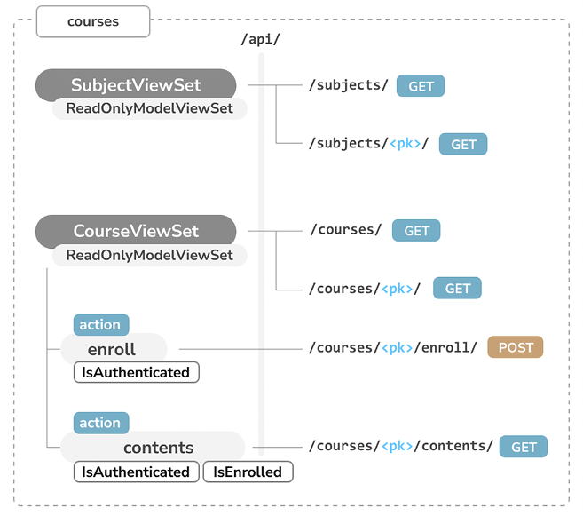
<p>Figure 15.1 Diagram of API views and endpoints to be built in Chapter 15</p>

# Building a RESTful API

## Your API will provide the following functionalities:
- Retrieving subjects
- Retrieving available courses
- Retrieving course contents
- Enrolling in a course

text```
You can build an API from scratch with Django by creating custom views. However, there are several third-party modules that simplify creating an API for your project; the most popular among them is Django REST framework (DRF).
```

## DRF provides a comprehensive set of tools to build RESTful APIs for your projects.
- Serializers
- Parsers and renderers
- API views
- URLs
- Authentication and permissions

## Installing Django REST framework:

```bash
python -m pip install djangorestframework==3.15.1
```

## Update settings.py:

```python
INSTALLED_APPS = [
    # …
        'rest_framework',
		# …

]

REST_FRAMEWORK = {
     'DEFAULT_PERMISSION_CLASSES': [
         'rest_framework.permissions.DjangoModelPermissionsOrAnonReadOnly'
    ]
 }
```

# Defining serializers

## The framework provides the following classes to build serializers for single objects:
- Serializer
- ModelSerializer
- HyperlinkedModelSerializer

## Create the following file structure inside the courses application directory:

```text
api/
     __init__.py
     serializers.py
```

## Open the Python shell to test

```bash
docker compose exec web python manage.py shell
```

# Understanding parsers and renderers

## Open the Python shell to test

```bash
docker compose exec web python manage.py shell
```

# Building list and detail views

## In this code, you use the generic ListAPIView and RetrieveAPIView views of DRF.
- queryset
- serializer_class

# Consuming the API

## Open http://127.0.0.1:8000/api/subjects/ in your browser.

## Figure 15.2 The Subject List page in the REST framework browsable API

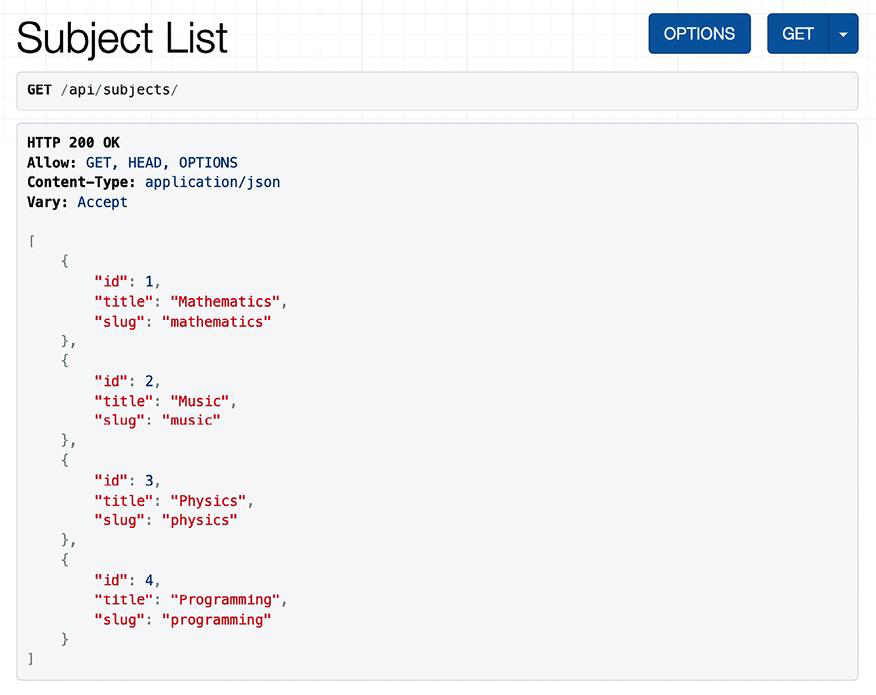
<p>Figure 15.2 The Subject List page in the REST framework browsable API</p>

## Open http://127.0.0.1:8000/api/subjects/1/ in your browser.
 
## Figure 15.3 The Subject Detail page in the REST framework browsable API

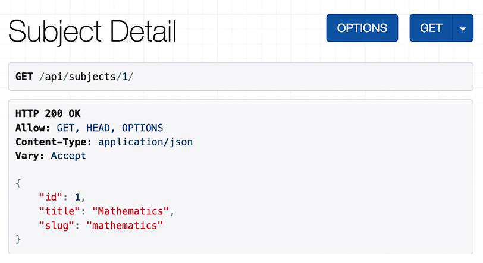
<p>Figure 15.3 The Subject Detail page in the REST framework browsable API</p>

# Extending serializers

## Adding additional fields to serializers

## Open http://127.0.0.1:8000/api/subjects/1/ in your browser.

## Figure 15.4 The Subject Detail page, including the total_courses attribute

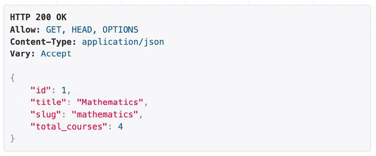
<p>Figure 15.4 The Subject Detail page, including the total\_courses attribute</p>
 
## Implementing serializer method fields

## Figure 15.5 The subject detail page, including the popular_courses attribute

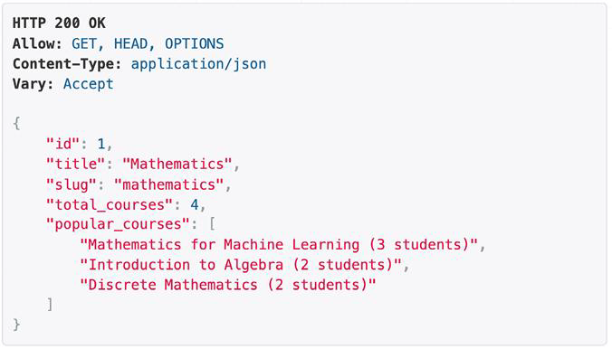
<p>Figure 15.5 The subject detail page, including the popular\\\_courses attribute</p>


# Adding pagination to views

## This class provides support for pagination based on page numbers. We set the following attributes:
- page_size
- page_size_query_params
- max_page_size

## The following items are now part of the JSON returned:
- count
- next
- previous
- results

## Open http://127.0.0.1:8000/api/subjects/?page_size=2&page=1 in your browser.

## Figure 15.6 First page of results for the subject list pagination, with a page size of 2

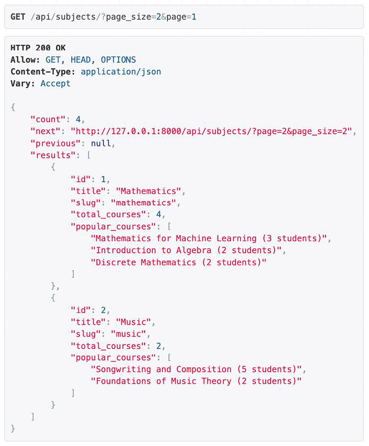
<p>Figure 15.6 First page of results for the subject list pagination, with a page size of 2</p>

# Building the course serializer

## Open the Python shell to test

```bash
docker compose exec web python manage.py shell
```

## Serializing relations

## Creating nested serializers

# Creating ViewSets and routers

## ViewSets allow you to define the interactions of your API and let DRF build URLs dynamically with a Router object.
- Create operation: create()
- Retrieve operation: list() and retrieve()
- Update operation: update() and partial_update()
- Delete operation: destroy()

## Open http://127.0.0.1:8000/api/ in your browser.

## Figure 15.7 The API Root page of the REST framework browsable API

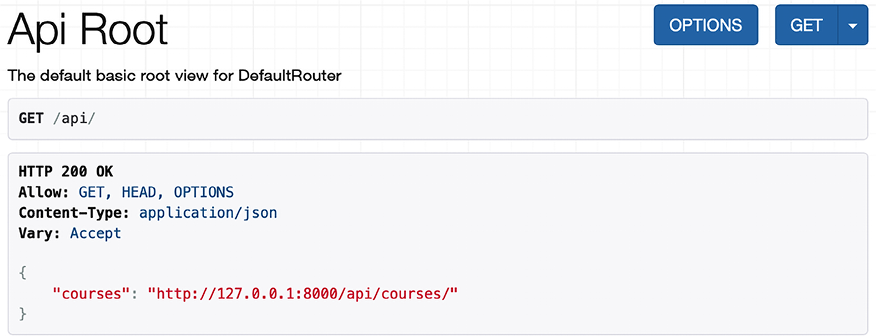
<p>Figure 15.7 The API Root page of the REST framework browsable API</p>

## Open http://127.0.0.1:8000/api/courses/ to retrieve the list of courses
 
## Figure 15.8 The Course List page in the REST framework browsable API

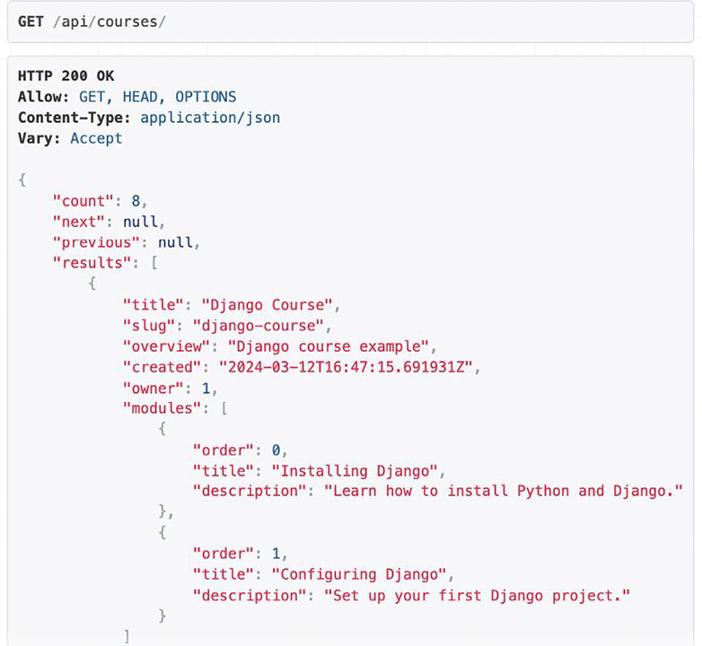
<p>Figure 15.8 The Course List page in the REST framework browsable API</p>

## Open http://127.0.0.1:8000/api/ in your browser.

## Figure 15.9 The API Root page of the REST framework browsable API

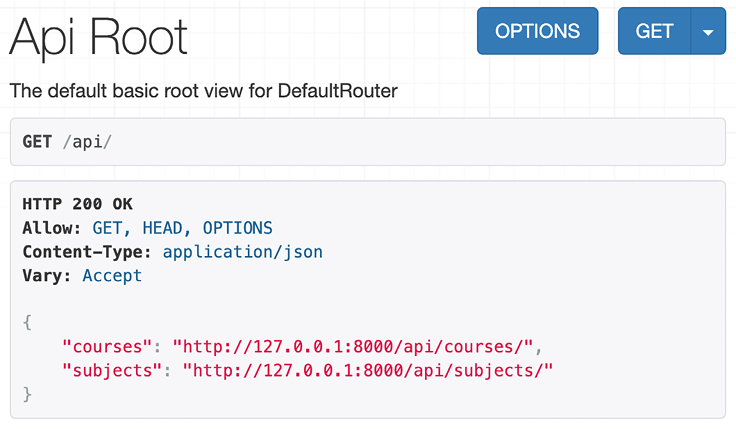
<p>Figure 15.9 The API Root page of the REST framework browsable API</p>

# Building custom API views

## The CourseEnrollView view handles user enrollment in courses. The preceding code is as follows:

1. You create a custom view that subclasses APIView .

2. You define a post() method for POST actions. No other HTTP method will be allowed for this view.

3. You expect a pk URL parameter containing the ID of a course. You retrieve the course by the given pk parameter and raise a 404 exception if it’s not found.

4. You add the current user to the students many-to-many relationship of the Course object and return a successful response.

# Handling authentication

## DRF provides the following authentication backends:
- BasicAuthentication
- TokenAuthentication
- SessionAuthentication
- RemoteUserAuthentication

# Implementing basic authentication

## Adding permissions to views, DRF includes a permission system to restrict access to views.
- AllowAny
- IsAuthenticated
- IsAuthenticatedOrReadOnly
- DjangoModelPermissions
- DjangoObjectPermissions

## If users are denied permission, they will usually get one of the following HTTP error codes:
- HTTP 401 : Unauthorized
- HTTP 403 : Permission denied

# Adding additional actions to ViewSets

## The preceding code is as follows:

1. You use the action decorator of the framework with the parameter detail=True to specify that this is an action to be performed on a single object.

2. The decorator allows you to add custom attributes for the action. You specify that only the post() method is allowed for this view and set the authentication and          permission classes.

3. You use self.get_object() to retrieve the Course object.

4. You add the current user to the students many-to-many relationship and return a custom    success response.

# Creating custom permissions

## Only students enrolled on a course should be able to access its contents:
- has_permission() : A view-level permission check
- has_object_permission() : An instance-level permission check

# Serializing course contents

## The description of this method is as follows:

1. You use the action decorator with the parameter detail=True to specify an action that is performed on a single object.

2. You specify that only the GET method is allowed for this action.

3. You use the new CourseWithContentsSerializer serializer class that includes rendered course contents.

4. You use both IsAuthenticated and your custom IsEnrolled permissions. By doing so, you make sure that only users enrolled in the course are able to access its contents.

5. You use the existing retrieve() action to return the Course object.

# Consuming the RESTful API

## Install the Requests library with the following command:

```bash
python -m pip install requests==2.31.0
```

## Create a new directory next to the educa project directory and name it api_examples:

```text
api_examples/
             enroll_all.py
                       educa/
```

## In this code, you perform the following actions:

1. You import the Requests library and define the base URL for the API and the URL for the course list API endpoint.

2. You define the available_courses empty list.

3. You use a while statement to paginate over all result pages.

4. You use requests.get() to retrieve data from the API by sending a GET request to the URL http://127.0.0.1:8000/api/courses/ . This API endpoint is publicly accessible,    so it does not require any authentication.

5. You use the json() method of the response object to decode the JSON data returned by the API.

6. You store the next attribute in the url variable to retrieve the next page of results in the while statement.

7. You add the title attribute of each course to the available_courses list.

8. When the url variable is None , you go to the latest page of results and you don’t retrieve any additional pages.

9. You print the list of available courses.

## Start the development server from the educa project:
```bash
docker compose up
```
## In another cmd, run:

```bash
python enroll_all.py
```

## With the new code, you perform the following actions:

1. You define the username and password of the student you want to enroll in   courses.

2. You iterate over the available courses retrieved from the API.

3. You store the course ID attribute in the course_id variable and the title attribute in the course_title variable.

4. You use requests.post() to send a POST request to the URL
   http://127.0.0.1:8000/api/courses/[id]/enroll/ for each course. This URL corresponds to the CourseEnrollView API view, which allows you to enroll a user in a course.      You build the URL for each course using the course_id variable. The CourseEnrollView view requires authentication. It uses the IsAuthenticated permission and the          BasicAuthentication authentication class. The Requests library supports HTTP basic authentication out of the box. You use the auth parameter to pass a tuple with the      username and password to authenticate the user, using HTTP basic authentication.

5. If the status code of the response is 200 OK , you print a message to indicate that the user has been successfully enrolled in the course.

## Run the following command from the api_examples/ directory:

```bash
python enroll_all.py
```

```text
You will now see output like this:
Available courses: Introduction to Django, Python for beginners,
Successfully enrolled in Introduction to Django
Successfully enrolled in Python for beginners
Successfully enrolled in Algebra basics
```

---

# Chapter 16. Building a Chat Server

## In this chapter, you will:

- Add Channels to your project
- Build a WebSocket consumer and appropriate routing
- Implement a WebSocket client
- Enable a channel layer with Redis
- Make your consumer fully asynchronous
- Persist chat messages into the database

## Functional overview

## Figure 16.1 Diagram of functionalities built in this chapter

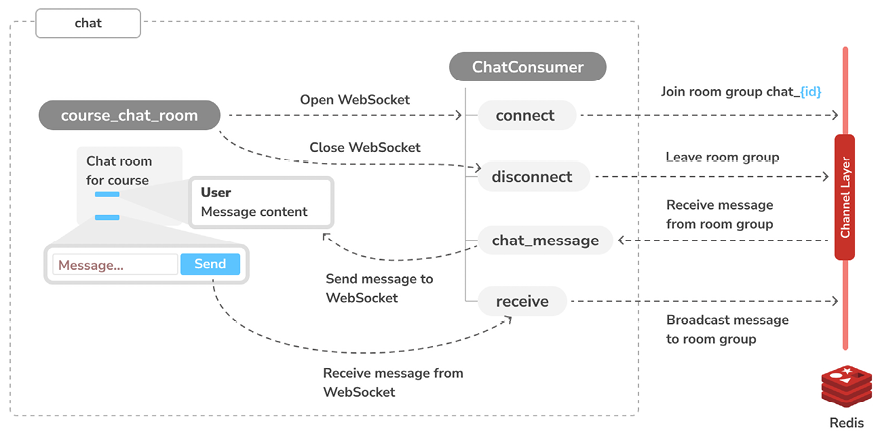
<p>Figure 16.1 Diagram of functionalities built in this chapter</p>

# Creating a chat application

## Create chat the new application file structure:

```bash
django-admin startapp chat
```bash

# Update settings.py:

```python
INSTALLED_APPS = [
    # …
        'chat.apps.ChatConfig',
		# …

]
```

# Implementing the chat room view

## This is the course_chat_room view.

1. The view receives a required course_id parameter that is used to retrieve the course with the given id .

2. The courses that the user is enrolled in are retrieved through the courses_joined relationship and the course with the given id is obtained from that subset of courses. If the course with the given id does not exist or the user is not enrolled in it, an HttpResponseForbidden response is returned, which translates to an HTTP response with status 403 .

3. If the course with the given id exists and the user is enrolled in it, the chat/room.html template is rendered, passing the course object to the template context.

## Create the following file structure within the chat application directory:

```text
templates/
          chat/
              room.html
```

## This is the template for the course chat room. In this template, you perform the following actions:

1. You extend the base.html template of your project and fill its content block.

2. You define a <div> HTML element with the chat ID that you will use to display the chat messages sent by the user and by other students.

3. You also define a second <div> element with a text input and a submit button that will allow the user to send messages.

4. You add the include_js and domready blocks defined in the base.html template, which you are going to implement later, to establish a connection with a WebSocket and       send or receive messages.

## Open http://127.0.0.1:8000/chat/room/1/

## Figure 16.2 The course chat room page

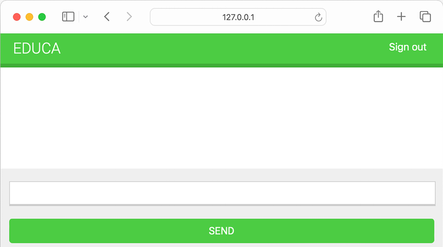
<p>Figure 16.2 The course chat room page</p>

# Real-time Django with Channels

## Asynchronous applications using ASGI

## The request/response cycle using Channels

## Figure 16.3 The Django request-response cycle

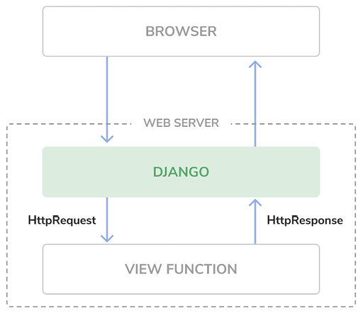
<p>Figure 16.3 The Django request-response cycle</p>

## Figure 16.4 The Django Channels request-response cycle

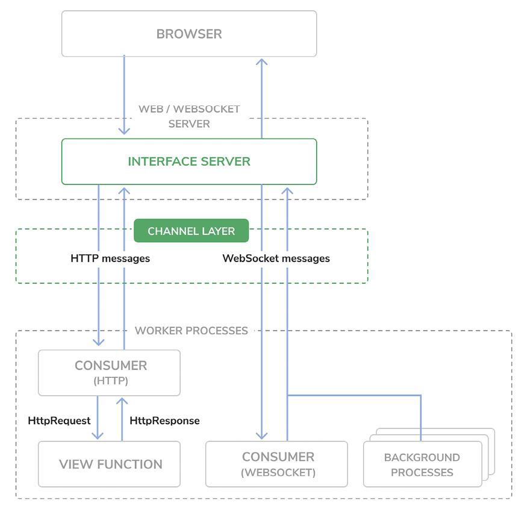
<p>Figure 16.4 The Django Channels request-response cycle</p>

# Installing Channels and Daphne

## Install Channels in your virtual environment with the following command:

```bash
python -m pip install -U 'channels[daphne]==4.1.0'
```

# Update settings.py:

```python
INSTALLED_APPS = [
    # …
        'daphne',
		# …
]
```

## To implement the chat server for your project, you will need to take the following steps:

1. Set up a consumer

2. Configure routing

3. Implement a WebSocket client

4. Enable a channel layer

# Writing a consumer

## This is the ChatConsumer consumer:
- connnect()
	a. self.accept()
	b. self.close()
- disconnect()
- receive()

# Routing

## Implementing the WebSocket client

## You will perform the following tasks related to the WebSocket client:

1. Open a WebSocket connection with the server when the page is loaded.

2. Add messages to an HTML container when data is received through the WebSocket.

3. Attach a listener to the submit button to send messages through the WebSocket when the user clicks the SEND button or presses the Enter key.

## Open the URL http://127.0.0.1:8000/chat/room/1/ in your browser, you should see two lines, including WebSocket HANDSHAKING and WebSocket CONNECT , like the following output:

```text
HTTP GET /chat/room/1/ 200 [0.02, 127.0.0.1:57141]
WebSocket HANDSHAKING /ws/chat/room/1/ [127.0.0.1:57144]
WebSocket CONNECT /ws/chat/room/1/ [127.0.0.1:57144]
```

## Figure 16.5 The browser developer tools showing that the WebSocket connection has been established

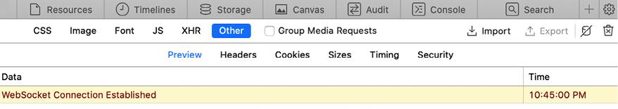
<p>Figure 16.5 The browser developer tools showing that the WebSocket connection has been established</p>

## In this code, you define the following events for the WebSocket client:
- onmessage
- onclose

## When the button is clicked, you perform the following actions:

1. You read the message entered by the user from the value of the text input element with the ID chat-message-input .

2. You check whether the message has any content with if(message) .

3. If the user has entered a message, you form JSON content such as {'message': 'string entered by the user'} by using JSON.stringify() .

4. You send the JSON content through the WebSocket, calling the send() method of chatSocket client.

5. You clear the contents of the text input by setting its value to an empty string with input.value = '' .

6. You return the focus to the text input with input.focus() so that the user can write a new message straight away.

## For any key that the user presses, you perform the following actions:

1. You check whether its key is Enter.

2. If the Enter key is pressed:
	a. You prevent the default behavior for this key with event.preventDefault() .
	b. Then you fire the click event on the submit button to send the message to the   WebSocket.

## Open the URL http://127.0.0.1:8000/chat/room/1/ in your browser:

## Figure 16.6 The chat room page, including messages sent through the WebSocket

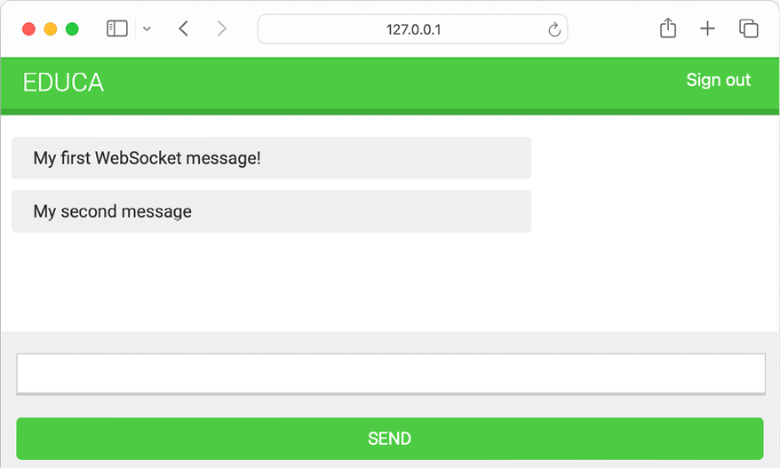
<p>Figure 16.6 The chat room page, including messages sent through the WebSocket</p>

# Enabling a channel layer

## Channels and groups:
- Channel:
- Group

# Setting up a channel layer with Redis

## Install channels-redis:

```bash
python -m pip install channels-redis==4.2.0
```

# Update settings.py:

```python
CHANNEL_LAYERS = {
     'default': {
         'Backend': 'channels_redis.core.RedisChannelLayer',
         'CONFIG': {
             'host': [('127.0.0.1', 6379)],
         },
     },
 }
```

## RedisChannelLayer  is running on host 127.0.0.1 and the port 6379.

## Open the Python shell to test:

```bash
docker compose exec web python manage.py shell
```

# Updating the consumer to broadcast messages

## In the new connect() method, you perform the following tasks:

1. You retrieve the course id from the scope to know the course that the chat room is associated with. You access self.scope['url_route'] ['kwargs']['course_id'] to          retrieve the course_id parameter from the URL. Every consumer has a scope with information about its connection, arguments passed by the URL, and the authenticated        user, if any.

2. You build the group name with the id of the course that the group corresponds to. Remember that you will have a channel group for each course chat room. You store the     group name in the room_group_name attribute of the consumer.

3. You join the group by adding the current channel to the group. You obtain the channel name from the channel_name attribute of the consumer. You use the group_add          method of the channel layer to add the channel to the group. You use the async_to_sync() wrapper to use the channel layer asynchronous method.

4. You keep the self.accept() call to accept the WebSocket connection. When the ChatConsumer consumer receives a new WebSocket connection, it adds the channel to the         group associated with the course in its scope. The consumer is now able to receive any messages sent to the group.

## You use the async_to_sync() wrapper to use the channel layer asynchronous method.
- type
- message

## Open the URL http://127.0.0.1:8000/chat/room/1/ in your browser.

## Figure 16.7 The chat room page with messages sent from different browser windows

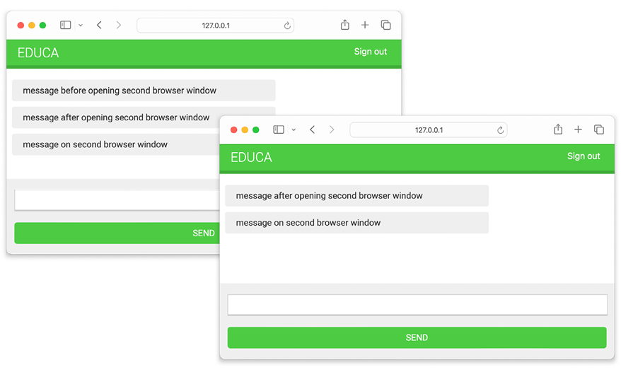
<p>Figure 16.7 The chat room page with messages sent from different browser windows</p>

# Adding context to the messages

## In this code, you implement the following changes:

1. You convert the datetime received in the message to a JavaScript Date object and format it with a specific locale.
2. You compare the username received in the message with two different constants as helpers to identify the user.

3. The constant source gets the value me if the user sending the message is the current user, or other otherwise.

4. The constant name gets the value Me if the user sending the message is the current user or the name of the user sending the message otherwise. You use it to display       the name of the user sending the message.

5. You use the source value as a class of the main <div> message element to differentiate messages sent by the current user from messages sent by others. Different CSS       styles are applied based on the class attribute. These CSS styles are declared in the css/base.css static file.

6. You use the username and the datetime in the message that you append to the chat log.

## Open the URL http://127.0.0.1:8000/chat/room/1/ in your browser. replacing 1 with the id of an existing course in the database.

## Figure 16.8 The chat room page with messages from two different user sessions

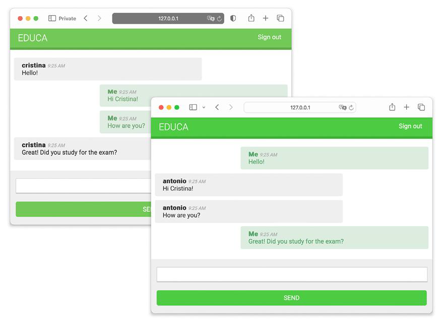
<p>Figure 16.8 The chat room page with messages from two different user sessions</p>

# Modifying the consumer to be fully asynchronous

## You have implemented the following changes:

1. The ChatConsumer consumer now inherits from the AsyncWebsocketConsumer class to implement asynchronous calls.

2. You have changed the definition of all methods from def to async def .

3. You use await to call asynchronous functions that perform I/O operations.

4. You no longer use the async_to_sync() helper function when calling methods on the channel layer.

## Open the URL http://127.0.0.1:8000/chat/room/1/ with two different browser windows again. and verify that the chat server still works. The chat server is now fully asynchronous!


# Persisting messages into the database

## To implement the chat history functionality, we will follow these steps:

1. We will create Django model to store chat messages and add it to the administration site.

2. We will modify the WebSocket consumer to persist messages.

3. We will retrieve the chat history to display the latest messages when users enter a chat room.

# Creating a model for chat messages

## This is the data model to persist chat messages. Let’s take a look at the fields of the Message model:
- user
- course
- content
- sent_on

## Migrations for the chat application:

```bash
docker compose exec web python manage.py makemigrations chat
docker compose exec web python manage.py migrate
```

## Adding the message model to the administration site

## Figure 16.9 The Chat application and Messages section on the administration site

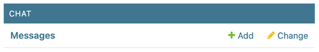
<p>Figure 16.9 The Chat application and Messages section on the administration site</p>

# Storing messages in the database

## open http://127.0.0.1:8000/chat/room/1/. Then, open a second browser window in incognito mode to prevent the use of the same session.

## Figure 16.10 Chat room example with messages sent by two different users

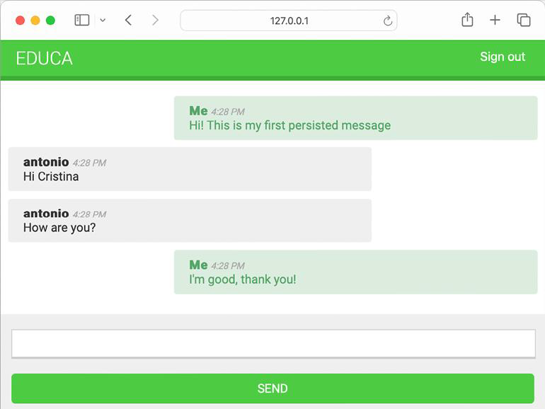
<p>Figure 16.10 Chat room example with messages sent by two different users</p>

## Open http://127.0.0.1:8000/admin/chat/message/ in your browser.

## Figure 16.11 Admin list display view of messages stored in the database

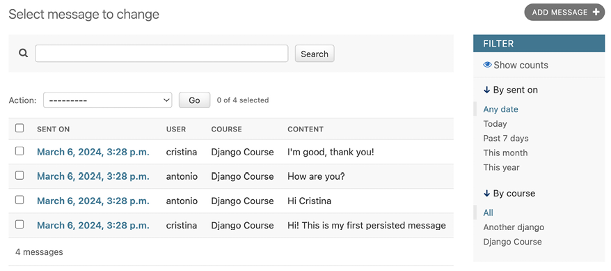
<p>Figure 16.11 Admin list display view of messages stored in the database</p>

# Displaying the chat history

## Open http://127.0.0.1:8000/chat/room/1/ in your browser.

## Figure 16.12 Chat room initially displaying the latest messages

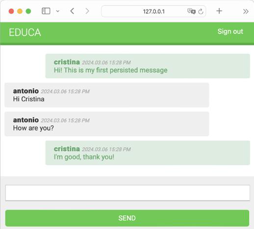
<p>Figure 16.12 Chat room initially displaying the latest messages</p>

# Integrating the chat application with existing views

## Open the browser and access any course that the student is enrolled in to view the course contents.
 
## Figure 16.13 The course detail page, including a link to the course chat room

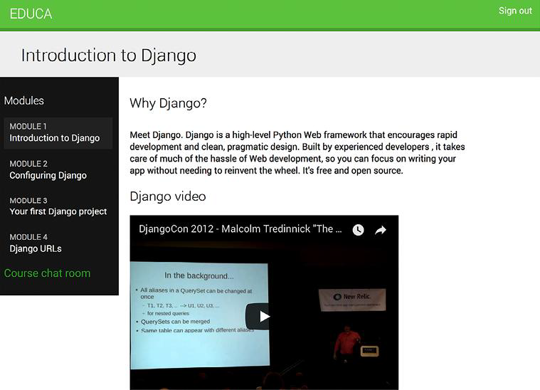
<p>Figure 16.13 The course detail page, including a link to the course chat room</p>

---

# Chapter 17. Going Live

## This chapter will cover the following topics:
- Configuring Django settings for multiple environments
- Setting up a web server with uWSGI and Django
- Serving PostgreSQL and Redis with Docker Compose
- Using the Django system check framework
- Serving NGINX with Docker
- Serving static assets through NGINX
- Securing connections through Transport Layer Security (TLS) / Secure Sockets Layer (SSL)
- Using the Daphne Asynchronous Server Gateway Interface (ASGI) server for Django Channels
- Creating a custom Django middleware
- Implementing custom Django management commands

# Creating a production environment

# Managing settings for multiple environments

## We will manage the following environments:
- local
- prod

```text
Create a settings/ directory next to the settings.py file of the educa project. Rename the settings.py file to base.py and move it into the new settings/ directory.
```

## Create the following additional files inside the settings/ folder so that the new directory looks as follows:

```text
settings/
          __init__.py
         base.py
         local.py
         prod.py
```

## These files are as follows:

```text
base.py
local.py
prod.py
```

## Edit the settings/base.py file and replace the following line:

```python
BASE_DIR = Path(__file__).resolve().parent.parent
```

## Replace the preceding line with the following one:

```python
BASE_DIR = Path(__file__).resolve().parent.parent.parent
```

## Edit the educa/settings/local.py :

```python
from .base import *
DEBUG = True
DATABASES = {
    'default': {
        'ENGINE': 'django.db.backends.postgresql',
        'NAME': 'postgres',
        'USER': 'postgres',
        'PASSWORD': 'postgres',
        'HOST': 'db',
        'PORT': 5432,
    }
}
```

# Production environment settings

##  These are the settings for the production environment:
- DEBUG
- ADMINS
- ALLOWED_HOSTS
- DATABASES

## Edit the educa/settings/prod.py :

```python
from .base import *

DEBUG = False

ADMINS = [
    ('jim WD', 'jim.webdeveloper57@gmail.com'),
]

ALLOWED_HOSTS = ['*']

DATABASES = {
    'default': {
        'ENGINE': 'django.db.backends.postgresql',
        'NAME': 'postgres',
        'USER': 'postgres',
        'PASSWORD': 'postgres',
        'HOST': 'db',
        'PORT': 5432,
    }
}
```

## Edit the educa/settings/prod.py :

```python
REDIS_URL = 'redis://cache:6379'
CACHES['default']['LOCATION'] = REDIS_URL
CHANNEL_LAYERS['default']['CONFIG']['hosts'] = [REDIS_URL]
```

```text
Open the Docker Desktop application. You should see now the Docker application running a container for each service defined in the Docker Compose file: db , cache , and web.
```

## Figure 17.1 The chapter17 application with the db-1, web-1, and cache-1 containers in Docker Desktop

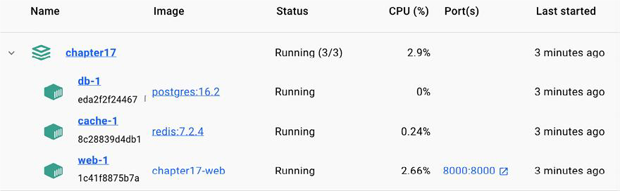
<p>Figure 17.1 The chapter17 application with the db-1, web-1, and cache-1 containers in Docker Desktop</p>

# Serving Django through WSGI and NGINX

## Using uWSGI

## Configuring uWSGI

## Next to the docker-compose.yml file, create the config/uwsgi/uwsgi.ini file path.

```text
         config/
                uwsgi/
        uwsgi.ini
        Dockerfile
        docker-compose.yml
        educa/
               manage.py
               ...
        requirements.txt
```

## Edit the config/uwsgi/uwsgi.ini:

```uwsgi
[uwsgi]
socket=/code/uwsgi_app.sock
chdir = /code/educa/ leave it if your path is educa/educa if not delete it chdir=/code/
module=educa.wsgi:application
master=true
chmod-socket=666
uid=www-data
gid=www-data
vacuum=true
```

## In the uwsgi.ini file, you define the following options:
- socket
- chdir
- module
- master 
- chmod-socket
- uid
- gid
- vacuum 

# Using NGINX

## Edit the docker-compose.yml:

```yml
services:
  db:
    # …
  cache:
    # ..   
  web:
    # … 
  nginx:
    image: nginx:1.25.5
    restart: always
    volumes:
      - ./config/nginx:/etc/nginx/templates
      - .:/code
    ports:
      - "80:80"
```

## You have added the definition for the nginx service with the following subsections:
- image
- restart
- volumes
- ports

# Configuring NGINX

## Create the following file path highlighted in bold under the config/ directory:

```text
config/
       uwsgi/
           uwsgi.ini
      nginx/
           default.conf.template
```

## Edit the nginx/default.conf.template file:

```nginx
# upstream for uWSGI
upstream uwsgi_app {
    server unix:/code/uwsgi_app.sock;
}

server {
    listen             80;
    server_name www.educaproject.com educaproject.com;
    error_log      stderr warn;
    access_log   /dev/stdout main;

    location / {
        include           /etc/nginx/uwsgi_params;
        uwsgi_pass   uwsgi_app;
    }
}
```

## This is the basic configuration for NGINX:

1.You tell NGINX to listen on port 80 .

2. You set the server name to both www.educaproject.com and educaproject.com . NGINX will serve incoming requests for both domains.

3. You use stderr for the error_log directive to get error logs written to the standard error file. The second parameter determines the logging level. You use warn to get    warnings and errors of higher severity.

4. You point access_log to the standard output with /dev/stdout .

5. You specify that any request under the / path has to be routed with the uwsgi_app socket to uWSGI.

6. You include the default uWSGI configuration parameters that come with NGINX. These are located at /etc/nginx/uwsgi_params .


## The following diagram shows the request/response cycle of the production environment that you have set up:

## Figure 17.2 The production environment request/response cycle

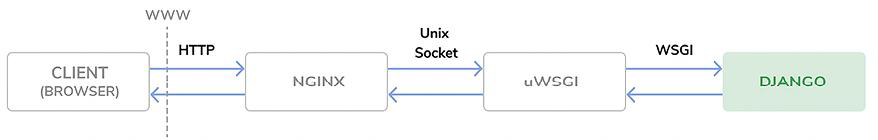
<p>Figure 17.2 The production environment request/response cycle</p>

## The following happens when the client browser sends an HTTP request:

1. NGINX receives the HTTP request.

2. NGINX delegates the request to uWSGI through a socket.

3. uWSGI passes the request to Django for processing.

4. Django returns an HTTP response that is passed back to NGINX, which in turn passes it back to the client browser.

## If you check the Docker Desktop application, you should see that there are four containers running:
- The db service is running PostgreSQL
- The cache service is running Redis
- The web service is running uWSGI and Django
- The nginx service is running NGINX

# Using a hostname

## Edit the C:\Windows\System32\drivers\etc file and add the same line.

1. Open Notepad as Administrator

2. File type: All files (.)

3. Look for the hosts file

4. Open:hosts

5. Add this line at the bottom:

   - 127.0.0.1 educaproject.com
   - 127.0.0.1 www.educaproject.com

6. Run:http://educaproject.com

## Restrict the hosts that can serve your Django project. Edit the educa/settings/prod.py:

```prod
ALLOWED_HOSTS = ['educaproject.com', 'www.educaproject.com']
```

## Serving static and media assets

## Edit the settings/base.py file:

```python
STATIC_URL = 'static/'
STATIC_ROOT = BASE_DIR / 'static'
```
# Collecting static files

## Run:

```bash
docker compose exec web python /code/manage.py collectstatic
```

## Serving static and media assets

## Edit the config/nginx/default.conf.template file:

```default.conf.template
server {
    # …
    location / {
        include /etc/nginx/uwsgi_params;
        uwsgi_pass uwsgi_app;
    }
    location /static/ {
        alias /code/static/;
    }
    location /media/ {
        alias /code/media/;
    }
}
```

## These directives tell NGINX to serve static files located under:
- /static/
- /media/

## Figure 17.3 The production environment request/response cycle, including static files

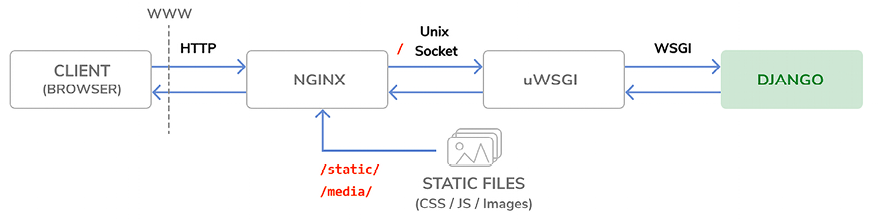
<p>Figure 17.3 The production environment request/response cycle, including static files</p>

## Open http://educaproject.com/ in your browser. You should see the following screen:

## Figure 17.4 The course list page served with NGINX and uWSGI

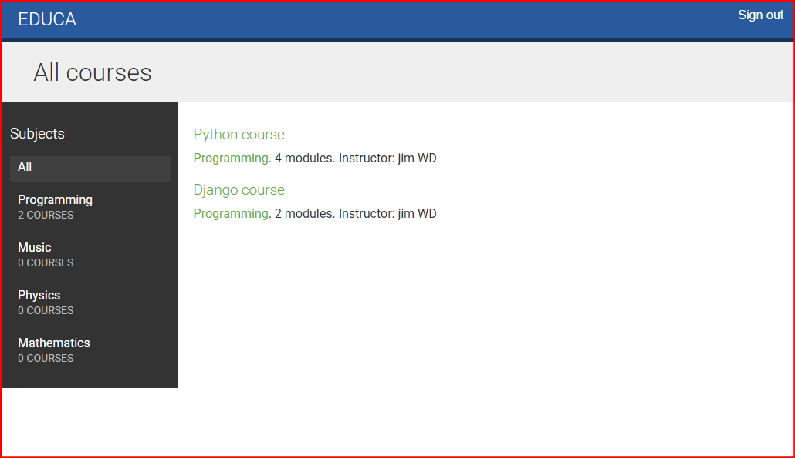
<p>Figure 17.4 The course list page served with NGINX and uWSGI</p>

# Securing your site with SSL/TLS

## Checking your project for production

## Let’s confirm that the check framework does not raise any issues for your project:

```bash
Docker compose exec web python manage.py check --settings=educa.settings.prod
```

## You will see the following output:
System check identified no issues (0 silenced).

## Run the following command from the educa project directory:

```bash
docker compose exec web python manage.py check --deploy --settings=educa.settings.prod
```

## You will see an output like the following:

```text
System check identified some issues:
WARNINGS:
(security.W004) You have not set a value for the SECURE_HSTS_SECO
(security.W008) Your SECURE_SSL_REDIRECT setting is not set to Tr
(security.W009) Your SECRET_KEY has less than 50 characters, less
(security.W012) SESSION_COOKIE_SECURE is not set to True. ...
(security.W016) You have 'django.middleware.csrf.CsrfViewMiddlewa
System check identified 5 issues (0 silenced).
```
# Configuring your Django project for SSL/TLS

## Edit the educa/settings/prod.py settings file:

```python
# Security
CSRF_COOKIE_SECURE = True
SESSION_COOKIE_SECURE = True
SECURE_SSL_REDIRECT = True
```

## Run the following command from the main directory of your project:

```bash
docker compose exec web python manage.py check --deploy --settings=educa.settings.prod
```

## Only two warning remains, security.W004:

```text
(security.W004) You have not set a value for the SECURE_HSTS_SECO
(security.W009) Your SECRET_KEY has less than 50 characters…………………………… which will disappear when you will create a self-certificate.
```

# Creating an SSL/TLS certificate

## Run on your terminal if you’re using Windows:

```bash
- docker run --rm -v ${PWD}/ssl:/ssl alpine/openssl req -x509 -newkey rsa:2048 -sha256 -days 3650 -nodes -keyout /ssl/educa.key -out /ssl/educa.crt -subj "/CN=*.educaproject.com" -addext "subjectAltName=DNS:*.educaproject.com"
```

## Configuring NGINX to use SSL/TLS

```text
The NGINX container host will be accessible through port 80 (HTTP) and port 443 (HTTPS). The host port 443 is mapped to the container port 443 .
```

## Edit the config/nginx/default.conf.template file:

```default.conf.template
server {
    listen       80;
    listen       443 ssl;
    ssl_certificate   /code/ssl/educa.crt;
    ssl_certificate_key   /code/ssl/educa.key;
    server_name www.educaproject.com educaproject.com;
}
```

## Stop the Docker and restart it:

```bash
docker compose up
```

## Open https://educaproject.com/ with your browser.

## Figure 17.5 An invalid certificate warning

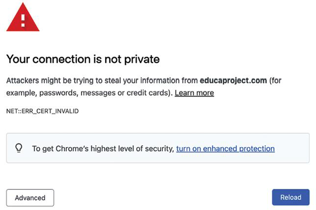
<p>Figure 17.5 An invalid certificate warning</p>

## Figure 17.6 The browser address bar, including a secure connection padlock icon

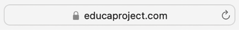
<p>Figure 17.6 The browser address bar, including a secure connection padlock icon</p>

### Figure 17.7 The browser address bar, including a warning message

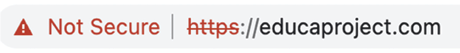
<p>Figure 17.7 The browser address bar, including a warning message</p>

# Redirecting HTTP traffic over to HTTPS

## Edit the config/nginx/default.conf.template file:

```default.conf.template
# upstream for uWSGI
upstream uwsgi_app {
    server unix:/code/educa/uwsgi_app.sock;
}

server {
    listen    80;
    server_name www.educaproject.com educaproject.com;
    return 301 https://$host$request_uri;
}

server {
    listen    443 ssl;
    ssl_certificate   /code/ssl/educa.crt;
    ssl_certificate_key   /code/ssl/educa.key;
    server_name www.educaproject.com educaproject.com;
    # …
}
```

## Stop nginx on the Docker desktop and restart it:

```bash
docker compose exec nginx nginx -s reload
```
## You should see the following:

```text
2026/05/01 16:41:16 [notice] 50#50: signal process started
```
 
# Configuring Daphne for Django Channels

## Edit the docker-compose.yml file:

```yml
daphne:
    build: .
    working_dir:   /code/
    command: ["/code/wait-for-it.sh", "db:5432", "--",
          "daphne", "-b", "0.0.0.0", "-p", "9001",
          "educa.asgi:application"]
    restart: always
    volumes:
      - .:/code
    environment:
      - DJANGO_SETTINGS_MODULE=educa.settings.prod
      - POSTGRES_DB=postgres
      - POSTGRES_USER=postgres
      - POSTGRES_PASSWORD=postgres
    depends_on:
      - db
      - cache
```

## The main differences with web service are as follows:

working_dir changes the working directory of the image to /code/educa/ .

2. command runs the educa.asgi:application application defined in the educa/asgi.py file with daphne in the 0.0.0.0 hostname and port 9001 . It also uses the wait-for-it bash script to wait for the PostgreSQL database to be ready before initializing the web server.

## Edit the educa/asgi.py file:

# Using secure connections for WebSockets

## Edit the chat/room.html template of the chat application and find the following line in the domready block and add a 's' on 'ws':

```room
const url = 'wss://' + window.location.host +
```

# Including Daphne in the NGINX configuration

## Edit the config/nginx/default.conf.template file:

## Figure 17.8 The production environment request - response cycle, including Daphne

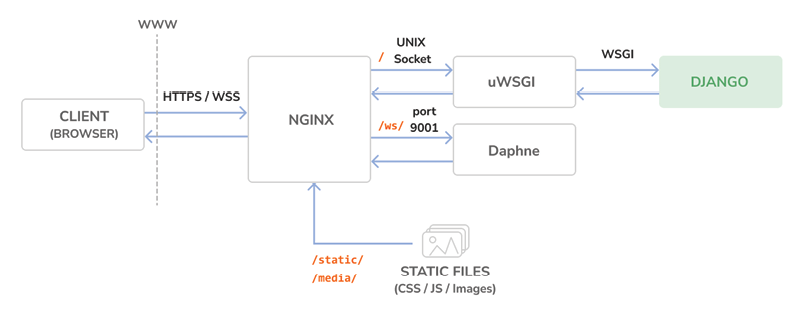
<p>Figure 17.8 The production environment request - response cycle, including Daphne</p>

## Stop the Docker and restart it:

```bash
docker compose up
```

## Figure 17.9 Course chat room messages served with NGINX and Daphne

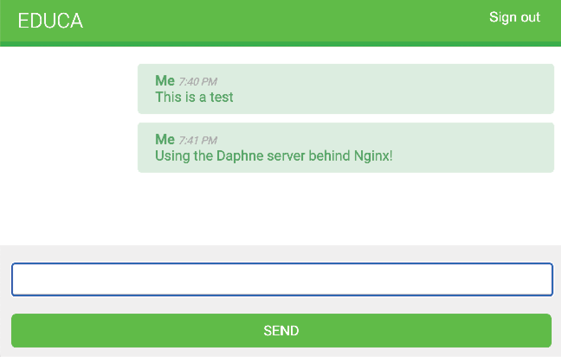
<p>Figure 17.9 Course chat room messages served with NGINX and Daphne</p>

# Creating a custom middleware

## Figure 17.10 Middleware execution in Django

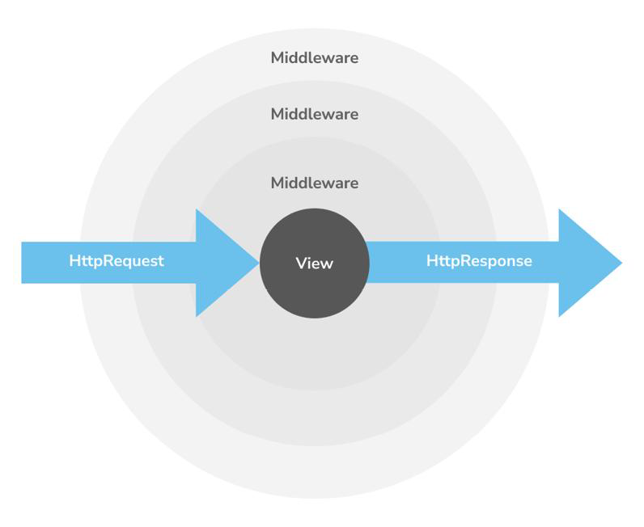
<p>Figure 17.10 Middleware execution in Django</p>

## Figure 17.11 Execution order for default middleware components

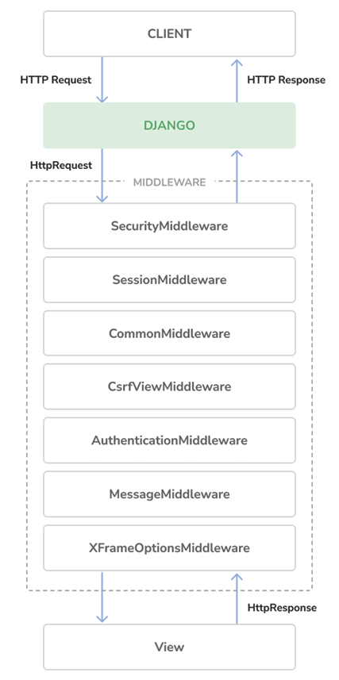
<p>Figure 17.11 Execution order for default middleware components</p>

# Creating subdomain middleware

## When an HTTP request is received, you perform the following tasks:

1. You get the hostname that is being used in the request and divide it into parts. For example, if the user is accessing mycourse.educaproject.com , you generate the        ['mycourse', 'educaproject', 'com'] list.

2. You check whether the hostname includes a subdomain by checking whether the split generated more than two elements. If the hostname includes a subdomain, and this is      not www , you try to get the course with the slug provided in the subdomain.

3. If a course is not found, you raise an HTTP 404 exception. Otherwise, you redirect the browser to the course detail URL.

## Edit the settings/base.py file of the project:

```python
MIDDLEWARE = [
    # …
    'courses.middleware.subdomain_course_middleware',
]
```

## Edit the educa/settings/prod.py file and modify the ALLOWED_HOSTS setting, as follows:

```python
ALLOWED_HOSTS = ['.educaproject.com']
```
# Serving multiple subdomains with NGINX

```text
Edit the config/nginx/default.conf.template file at these two occurrences:
server_name www.educaproject.com educaproject.com;

Replace the occurences of the preceding line with the following one:
server_name *.educaproject.com educaproject.com;
```
## Stop the Docker and restart it:

```bash
docker compose up
```

```text
Then, open https://django.educaproject.com/ in your browser. The middleware will find the course by the subdomain and redirect your browser to https://educaproject.com/course/django/ .

Your custom subdomain middleware is working!
```

# Implementing custom management commands

## Create the following file structure inside the students application directory:

```text
management/
          __init__.py
         commands/
                    __init__.py
                   enroll_reminder.py
```

## Edit the enroll_reminder.py file.

## This is your enroll_reminder command. The preceding code is as follows:

- The Command class inherits from BaseCommand.

- You include a help attribute. This attribute provides a short description of the command that is printed if you run the python manage.py help enroll_reminder command.

- You use the add_arguments() method to add the --days named argument. This argument is used to specify the minimum number of days a user has to be registered, without      having enrolled in any course, in order to receive the reminder.

- The handle() command contains the actual command. You get the days attribute parsed from the command line. If this is not set, you use 0 , so that a reminder is sent to   all users that haven’t enrolled on a course, regardless of when they registered. You use the timezone utility provided by Django to retrieve the current timezone-aware    date with timezone.now().date() . (You can set the timezone for your project with the TIME_ZONE setting.) You retrieve the users who have been registered for more than    the specified days and are not enrolled in any courses yet. You achieve this by annotating the QuerySet with the total number of courses each user is enrolled in. You     generate the reminder email for each user and append it to the emails list. Finally, you send the emails using the send_mass_mail() function, which is optimized to open   a single SMTP connection for sending all emails, instead of opening one connection per email sent.

## Open the cmd and run your command:

```bash
docker compose exec web python manage.py enroll_reminder --days=20 --settings=educa.settings.prod
```

```text
If you don’t have a local SMTP server running, you can look at Chapter 2, Enhancing Your Blog with Advanced Features, where you configured the SMTP settings for your first Django project. Alternatively, you can add the following setting to the base.py file to make Django output emails to the standard output during development:
EMAIL_BACKEND = 'django.core.mail.backends.console.EmailBackend'
```

```text
Django also includes a utility to call management commands using Python.
You can run management commands from your code as follows:
from django.core import management
management.call_command('enroll_reminder', days=20)
```
# GIF

## 🎥 GIF Django_preview.

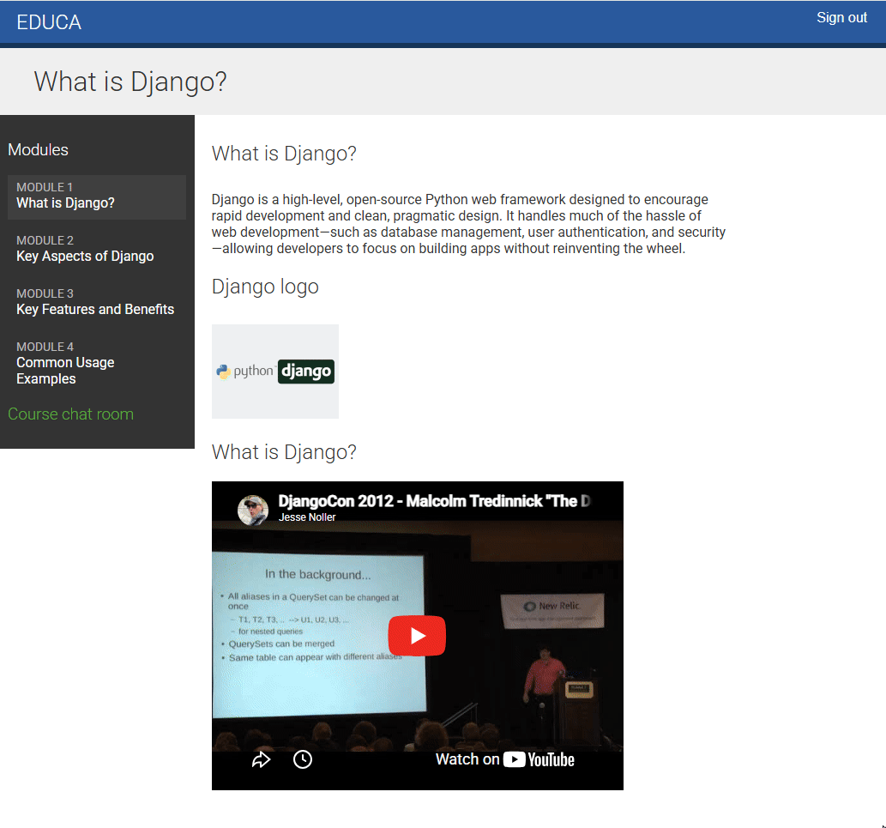
<p>GIF Video play</p>

## 🎥 GIF Python_preview.

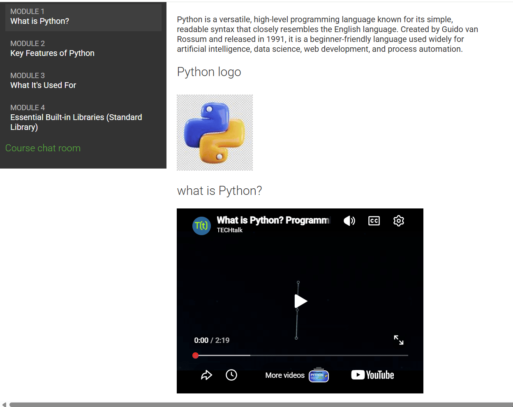
<p>GIF Video play</p>

## 🎥 GIF Chat room Preview

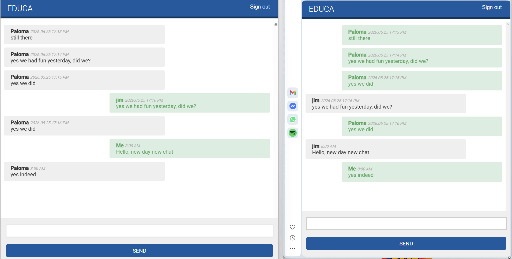
<p>GIF Chat room Preview</p>

## 🔗 Related Repository

This project includes a code repository documenting the full development implementation.

👉 https://github.com/jeanmarc-webdev/dockerized-e-learning-platform
